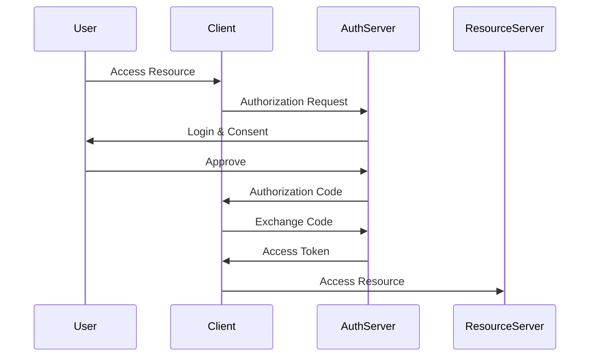

# OAuth 2.0 and OpenID Connect

## Table of Contents
- [Introduction](#introduction)
- [OAuth 2.0 Flows](#oauth-20-flows)
- [OpenID Connect](#openid-connect)
- [Implementation Strategies](#implementation-strategies)
- [Common Use Cases](#common-use-cases)
- [Interview Tips](#interview-tips)

## Introduction

OAuth 2.0 and OpenID Connect provide standardized protocols for authorization and authentication.

### Key Benefits
1. **Standardized Security**
2. **Delegated Access**
3. **Token-based Security**
4. **Identity Federation**
5. **Scalable Authentication**

## OAuth 2.0 Flows

### 1. Authorization Code Flow


```python
class AuthorizationCodeFlow:
    def initiate_flow(self, client_id, redirect_uri):
        """Start authorization code flow"""
        auth_request = {
            'response_type': 'code',
            'client_id': client_id,
            'redirect_uri': redirect_uri,
            'scope': 'read write',
            'state': self.generate_state()
        }
        
        return self.build_auth_url(auth_request)
        
    async def exchange_code(self, code, client_id, client_secret):
        """Exchange code for tokens"""
        token_request = {
            'grant_type': 'authorization_code',
            'code': code,
            'client_id': client_id,
            'client_secret': client_secret
        }
        
        response = await self.token_endpoint.request(token_request)
        return self.validate_tokens(response)
```

### 2. Client Credentials Flow
```python
class ClientCredentialsFlow:
    async def get_token(self, client_id, client_secret):
        """Get access token for service"""
        token_request = {
            'grant_type': 'client_credentials',
            'client_id': client_id,
            'client_secret': client_secret,
            'scope': 'service_scope'
        }
        
        response = await self.token_endpoint.request(token_request)
        return self.validate_tokens(response)
```

## OpenID Connect

### 1. Identity Token Validation
```python
class IDTokenValidator:
    def validate_token(self, id_token):
        """Validate ID token"""
        try:
            # Decode token
            header = jwt.get_unverified_header(id_token)
            
            # Get key
            key = await self.jwks_client.get_signing_key(
                header['kid']
            )
            
            # Verify token
            claims = jwt.decode(
                id_token,
                key.key,
                algorithms=['RS256'],
                audience=self.client_id,
                issuer=self.issuer
            )
            
            return self.validate_claims(claims)
        except Exception as e:
            raise InvalidToken(str(e))
```

### 2. UserInfo Endpoint
```python
class UserInfoEndpoint:
    async def get_user_info(self, access_token):
        """Get user information"""
        try:
            # Validate token
            if not await self.validate_token(access_token):
                raise InvalidToken()
                
            # Get user claims
            claims = await self.get_user_claims(access_token)
            
            # Filter claims based on scope
            return self.filter_claims(claims, access_token.scope)
        except Exception as e:
            raise UserInfoError(str(e))
```

## Implementation Strategies

### 1. Token Management
```python
class TokenManager:
    def __init__(self):
        self.token_store = TokenStore()
        
    async def get_valid_token(self, client_id):
        """Get or refresh access token"""
        token = await self.token_store.get_token(client_id)
        
        if not token:
            return await self.request_new_token(client_id)
            
        if self.is_token_expired(token):
            return await self.refresh_token(token)
            
        return token
        
    def is_token_expired(self, token):
        """Check if token is expired"""
        return datetime.utcnow() > token.expires_at
```

### 2. Scope Management
```python
class ScopeManager:
    def validate_scopes(self, requested_scopes, allowed_scopes):
        """Validate requested scopes"""
        # Convert to sets
        requested = set(requested_scopes.split())
        allowed = set(allowed_scopes.split())
        
        # Check if all requested scopes are allowed
        if not requested.issubset(allowed):
            invalid = requested - allowed
            raise InvalidScope(f"Invalid scopes: {invalid}")
            
        return True
```

## Common Use Cases

### 1. Single Sign-On
```python
class SSOProvider:
    async def handle_login(self, request):
        """Handle SSO login request"""
        try:
            # Validate request
            if not self.validate_request(request):
                raise InvalidRequest()
                
            # Authenticate user
            user = await self.authenticate_user(request)
            
            # Generate tokens
            access_token = self.generate_access_token(user)
            id_token = self.generate_id_token(user)
            
            return {
                'access_token': access_token,
                'id_token': id_token,
                'token_type': 'Bearer'
            }
        except Exception as e:
            raise AuthenticationError(str(e))
```

### 2. API Security
```python
class APISecurityMiddleware:
    async def process_request(self, request):
        """Process API request"""
        try:
            # Extract token
            token = self.extract_token(request)
            
            # Validate token
            if not await self.validate_token(token):
                raise InvalidToken()
                
            # Check scopes
            if not self.check_scopes(token, request.resource):
                raise InsufficientScope()
                
            return await self.process_request(request)
        except Exception as e:
            raise SecurityError(str(e))
```

## Interview Tips

### 1. Key Considerations
- Flow selection
- Token security
- Scope management
- User experience
- Security requirements

### 2. Common Questions
1. When to use different OAuth flows?
2. How to secure tokens?
3. How to handle token expiration?
4. How to implement refresh tokens?

### 3. Best Practices
- Use HTTPS everywhere
- Validate all tokens
- Implement proper scopes
- Secure token storage
- Regular security review

## Further Reading
- [OAuth 2.0 Specification](https://oauth.net/2/)
- [OpenID Connect Core](https://openid.net/specs/openid-connect-core-1_0.html)
- [OAuth Security Best Practices](https://oauth.net/articles/authentication/)

