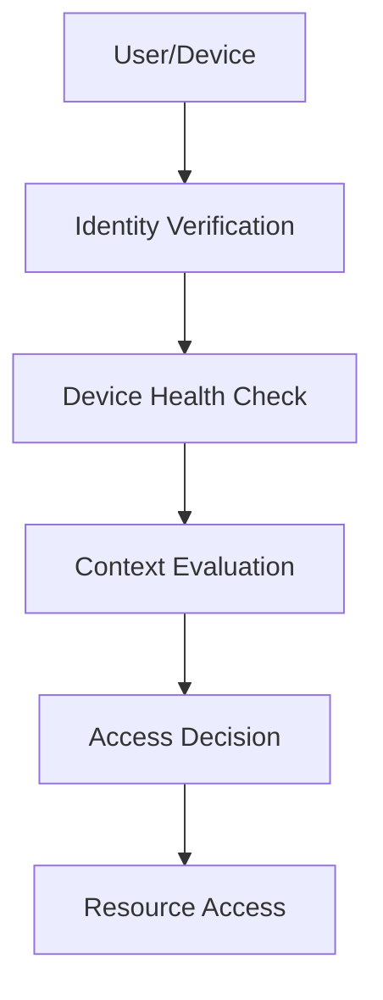

# Zero Trust Architecture in System Design 📌

## Table of Contents

- [Introduction](#introduction)
- [Prerequisites & Related Topics](#prerequisites--related-topics)
- [Pattern Recognition Guide](#pattern-recognition-guide)
- [Core Principles](#core-principles)
- [Implementation Strategies](#implementation-strategies)
- [Security Controls](#security-controls)
- [Common Use Cases](#common-use-cases)
- [Trade-offs](#trade-offs)
- [Edge Cases to Consider](#edge-cases-to-consider)
- [Common Pitfalls](#common-pitfalls)
- [FAQ](#faq)
- [Interview Tips](#interview-tips)
- [Advanced Topics](#advanced-topics)
- [Further Reading](#further-reading)

## Introduction

Zero Trust Architecture (ZTA) is a security model that assumes no trust by default and requires verification from everyone trying to access resources in a network.

### Key Benefits
1. **Reduced Attack Surface**
2. **Better Access Control**
3. **Improved Visibility**
4. **Data Protection**
5. **Compliance Support**

## Prerequisites & Related Topics

- Builds on: [Authentication & Authorization](../system-basics/auth.md), Service Mesh
- Used in: [Cloud Security](../cloud-native/cloud-security.md), [API Security](api-security.md), [Secrets Management](secrets-management.md)
- Techniques often combined: mTLS everywhere, device posture, policy engines (OPA), short-lived credentials
- See also: [NIST SP 800-207](https://csrc.nist.gov/publications/detail/sp/800-207/final) — the canonical ZT architecture

## Pattern Recognition Guide

### 🎯 When to Use Zero Trust Architecture

**Keywords in requirements**: "zero trust", "never trust always verify", "mTLS", "identity-based access", "micro-segmentation", "beyond the perimeter"
**Reach for this when**:
- Workforce access replacing VPN with identity-aware proxies
- Service-to-service mTLS and authorization policies
- Multi-cloud estates without a shared network boundary
- High-compliance systems needing per-request verification

### 🔑 Approach Indicators

| Approach | Signals | Best For |
|----------|---------|----------|
| Identity-aware proxy | per-app access, no network trust | workforce access |
| Mesh mTLS + authz policy | service identity everywhere | microservice estates |
| Device posture checks | managed, patched, compliant | BYOD and remote work |
| Policy engine (OPA) | central decision, local enforcement | consistent policy |

### ❌ When NOT to Use

- Bought-as-a-box — zero trust is an architecture, not a SKU
- All at once — start with the highest-value access paths
- Network controls renamed — without per-request identity checks it is still perimeter trust

## Core Principles

### 1. Never Trust, Always Verify

### 2. Least Privilege Access
**How it works — Access control:** every request carries an identity and an action; the policy engine resolves whether that identity's roles/attributes permit the action on that resource, and denies by default — allow-lists, not block-lists.

## Implementation Strategies

### 1. Identity and Access Management
**How it works — Iamsystem:** identities (human and service) authenticate once, receive short-lived credentials, and every subsequent call is authorized against policy — the audit log of who did what is the compliance output.

### 2. Network Segmentation
**How it works — Network segmentation:** split the network into trust zones (edge, app, data) with default-deny between them; a compromised web tier then cannot reach the database directly — lateral movement requires defeating another control.

## Security Controls

### 1. Device Trust
**How it works — Device trust:** Devices publish over lightweight protocols to a gateway that authenticates, buffers, and forwards — the cloud side consumes the stream and scales independently of device count.

### 2. Data Protection
**How it works — Data protection:** layered defenses: encryption at rest and in transit, access control at the data layer, and audit logging on every read of sensitive fields — protection follows the data, not just the perimeter.

## Common Use Cases

### 1. Remote Access
**How it works — Remote access gateway:** Terminate the incoming connection at the edge component, apply cross-cutting policy (auth, limits, routing), and forward to the backend pool — clients see one stable address while pools change freely behind it.

### 2. Application Access
**How it works — Application gateway:** Terminate the incoming connection at the edge component, apply cross-cutting policy (auth, limits, routing), and forward to the backend pool — clients see one stable address while pools change freely behind it.

## Trade-offs

| Choice | Pros | Cons | Best For |
|----------|------|------|----------|
| Per-request verification | Breach containment, no implicit trust | Latency and complexity on every hop | High-value internal services |
| Network-perimeter trust | Simple, fast | Lateral movement after one breach | Legacy only |
| Strict device posture checks | Strong identity + device binding | User friction, device management cost | Regulated/remote workforces |
| Broad service mesh policies | Uniform enforcement | Mesh operational overhead | Large microservice fleets |

**Security vs friction:** Every verification step (mTLS, token checks, posture) protects and slows; prioritize verification depth by data sensitivity.

**Implicit trust vs explicit policy:** Zero trust turns invisible network assumptions into explicit, testable policy — more secure, far more to operate.

**Blast radius:** Zero trust's core win is containment: a stolen credential unlocks less because every call re-verifies.

> **⚠️ When NOT to enforce zero trust everywhere:** legacy systems that can't speak mTLS (wrap them in a gateway instead), low-sensitivity internal tooling, and teams without the operational maturity to run a mesh — stage it by data sensitivity.

## Edge Cases to Consider

- Legacy systems that cannot do mTLS — wrap with identity-aware gateways
- Break-glass access during ZT outages — documented and sealed
- Latency budget of per-request policy checks — cache decisions briefly
- Third-party integrations outside your identity plane

## Common Pitfalls

1. Focusing on users while services still trust the network
2. Policy sprawl without versioning or tests
3. No telemetry on denied requests — silent failures hide broken access
4. Assuming ZT removes the need for patching and hygiene

## FAQ

**Q1: What does zero trust actually replace?**

A: The implicit "inside the network is safe" assumption. Nothing replaces patching, least privilege, or monitoring — ZT adds per-request identity-based decisions on top.

**Q2: Is a VPN dead in zero trust?**

A: For app access, usually — identity-aware proxies grant per-app instead of per-network. Some remote access remains for privileged operations, tightly audited.

**Q3: Where do I start?**

A: Inventory identities and high-value paths, add MFA and short-lived credentials, wrap the top internal app with an identity proxy, then expand per service.

## Interview Tips

### 1. Key Considerations
- Identity verification
- Device security
- Network segmentation
- Data protection
- Continuous monitoring

### 2. Common Questions
1. How do you implement Zero Trust?
2. What are the key components?
3. How do you handle legacy systems?
4. How do you balance security and usability?

### 3. Best Practices
- Implement strong authentication
- Use micro-segmentation
- Monitor continuously
- Encrypt everywhere
- Regular assessment

## Advanced Topics

1. Workload identity federation across clouds (SPIFFE/SPIRE)
2. Risk-adaptive policies stepping up on anomaly signals
3. Continuous access evaluation with token revocation lists
4. Data-centric zero trust: per-object classification and policy

## Further Reading
- [NIST Zero Trust Architecture](https://www.nist.gov/publications/zero-trust-architecture)
- [Google BeyondCorp](https://cloud.google.com/beyondcorp)
- [Zero Trust Security](https://www.cloudflare.com/learning/security/glossary/what-is-zero-trust/)

