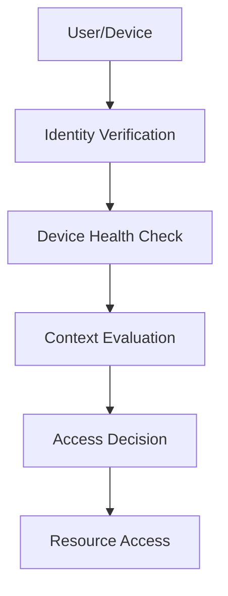

# Zero Trust Architecture

## Table of Contents
- [Introduction](#introduction)
- [Core Principles](#core-principles)
- [Implementation Strategies](#implementation-strategies)
- [Security Controls](#security-controls)
- [Common Use Cases](#common-use-cases)
- [Trade-offs](#trade-offs)
- [Interview Tips](#interview-tips)

## Introduction

Zero Trust Architecture (ZTA) is a security model that assumes no trust by default and requires verification from everyone trying to access resources in a network.

### Key Benefits
1. **Reduced Attack Surface**
2. **Better Access Control**
3. **Improved Visibility**
4. **Data Protection**
5. **Compliance Support**

## Core Principles

### 1. Never Trust, Always Verify


### 2. Least Privilege Access
```python
class AccessControl:
    def verify_access(self, user, resource, action):
        """Verify access rights"""
        # Check identity
        if not self.verify_identity(user):
            return False
            
        # Check device
        if not self.verify_device(user.device):
            return False
            
        # Check permissions
        if not self.check_permissions(user, resource, action):
            return False
            
        # Log access attempt
        self.log_access_attempt(user, resource, action)
        
        return True
```

## Implementation Strategies

### 1. Identity and Access Management
```python
class IAMSystem:
    def authenticate_user(self, credentials):
        """Authenticate user with MFA"""
        # Verify primary credentials
        if not self.verify_credentials(credentials):
            return False
            
        # Require MFA
        if not self.verify_mfa(credentials.user):
            return False
            
        # Check risk score
        risk_score = self.calculate_risk_score(credentials)
        if risk_score > self.risk_threshold:
            return False
            
        return True
        
    def authorize_access(self, user, resource):
        """Authorize resource access"""
        # Check user roles
        if not self.check_roles(user, resource):
            return False
            
        # Check resource policies
        if not self.check_policies(user, resource):
            return False
            
        # Check environmental factors
        if not self.check_context(user, resource):
            return False
            
        return True
```

### 2. Network Segmentation
```python
class NetworkSegmentation:
    def configure_segments(self):
        """Configure network segments"""
        return {
            'segments': {
                'production': {
                    'allowed_ips': ['10.0.0.0/8'],
                    'allowed_protocols': ['HTTPS'],
                    'required_auth': 'mfa'
                },
                'development': {
                    'allowed_ips': ['172.16.0.0/12'],
                    'allowed_protocols': ['HTTPS', 'SSH'],
                    'required_auth': 'standard'
                }
            },
            'default_policy': 'deny'
        }
```

## Security Controls

### 1. Device Trust
```python
class DeviceTrust:
    def verify_device(self, device):
        """Verify device security posture"""
        checks = {
            'os_version': self.check_os_version(device),
            'patch_level': self.check_patches(device),
            'antivirus': self.check_antivirus(device),
            'encryption': self.check_encryption(device),
            'certificates': self.check_certificates(device)
        }
        
        return all(checks.values())
```

### 2. Data Protection
```python
class DataProtection:
    def protect_data(self, data, context):
        """Apply data protection controls"""
        # Classify data
        classification = self.classify_data(data)
        
        # Apply encryption
        if classification.requires_encryption:
            data = self.encrypt_data(data)
            
        # Apply access controls
        self.apply_access_controls(data, classification)
        
        # Log access
        self.log_data_access(data, context)
        
        return data
```

## Common Use Cases

### 1. Remote Access
```python
class RemoteAccessGateway:
    async def handle_connection(self, connection):
        """Handle remote access request"""
        # Verify identity
        identity = await self.verify_identity(connection)
        if not identity:
            return self.deny_access("Invalid identity")
            
        # Check device
        device = await self.check_device(connection)
        if not device.compliant:
            return self.deny_access("Non-compliant device")
            
        # Evaluate context
        context = self.evaluate_context(connection)
        if context.risk_level > self.max_risk:
            return self.deny_access("High risk context")
            
        # Grant access
        return self.grant_access(connection, identity)
```

### 2. Application Access
```python
class ApplicationGateway:
    def authorize_request(self, request):
        """Authorize application request"""
        # Extract identity
        identity = self.get_identity(request)
        
        # Verify session
        if not self.verify_session(identity):
            return False
            
        # Check permissions
        if not self.check_permissions(identity, request.resource):
            return False
            
        # Apply policy
        return self.apply_policy(identity, request)
```

## Trade-offs

| Choice | Pros | Cons | Best For |
|----------|------|------|----------|
| Per-request verification | Breach containment, no implicit trust | Latency and complexity on every hop | High-value internal services |
| Network-perimeter trust | Simple, fast | Lateral movement after one breach | Legacy only |
| Strict device posture checks | Strong identity + device binding | User friction, device management cost | Regulated/remote workforces |
| Broad service mesh policies | Uniform enforcement | Mesh operational overhead | Large microservice fleets |

**Security vs friction:** Every verification step (mTLS, token checks, posture) protects and slows; prioritize verification depth by data sensitivity.

**Implicit trust vs explicit policy:** Zero trust turns invisible network assumptions into explicit, testable policy — more secure, far more to operate.

**Blast radius:** Zero trust's core win is containment: a stolen credential unlocks less because every call re-verifies.

> **⚠️ When NOT to enforce zero trust everywhere:** legacy systems that can't speak mTLS (wrap them in a gateway instead), low-sensitivity internal tooling, and teams without the operational maturity to run a mesh — stage it by data sensitivity.

## Interview Tips

### 1. Key Considerations
- Identity verification
- Device security
- Network segmentation
- Data protection
- Continuous monitoring

### 2. Common Questions
1. How do you implement Zero Trust?
2. What are the key components?
3. How do you handle legacy systems?
4. How do you balance security and usability?

### 3. Best Practices
- Implement strong authentication
- Use micro-segmentation
- Monitor continuously
- Encrypt everywhere
- Regular assessment

## Further Reading
- [NIST Zero Trust Architecture](https://www.nist.gov/publications/zero-trust-architecture)
- [Google BeyondCorp](https://cloud.google.com/beyondcorp)
- [Zero Trust Security](https://www.cloudflare.com/learning/security/glossary/what-is-zero-trust/)

