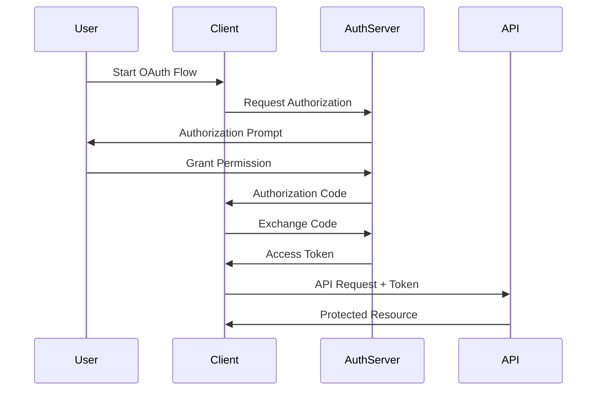

# API Design in System Design 📌

## Table of Contents

- [Introduction to APIs](#introduction-to-apis)
- [Prerequisites & Related Topics](#prerequisites--related-topics)
- [Pattern Recognition Guide](#pattern-recognition-guide)
- [API Design Principles](#api-design-principles)
- [REST API Design](#rest-api-design)
- [GraphQL APIs](#graphql-apis)
- [API Security](#api-security)
- [API Documentation](#api-documentation)
- [Trade-offs](#trade-offs)
- [Edge Cases to Consider](#edge-cases-to-consider)
- [Common Pitfalls](#common-pitfalls)
- [FAQ](#faq)
- [Interview Tips](#interview-tips)
- [Real-World Examples](#real-world-examples)
- [Advanced Topics](#advanced-topics)
- [Further Reading](#further-reading)

## Introduction to APIs

An API (Application Programming Interface) is a set of rules and protocols that allows different software applications to communicate with each other. Good API design is crucial for building scalable and maintainable distributed systems.

### Types of APIs
1. **REST APIs**
2. **GraphQL APIs**
3. **gRPC APIs**
4. **SOAP APIs**
5. **WebSocket APIs**

## Prerequisites & Related Topics

- **Builds on**: HTTP semantics, [Load Balancing](load-balancing.md) (gateways sit on the edge)
- **Used in**: [Microservices](../scalability/microservices.md), [API Gateway](../architecture/api-gateway.md), [Rate Limiting](../architecture/rate-limiting.md)
- **Techniques often combined**: contract-first specs, idempotency keys, cursor pagination, webhooks
- **See also**: [Message Queues](../architecture/message-queues.md) (when async beats request-response)

## Pattern Recognition Guide

### 🎯 When to Use API Design

**Keywords in requirements**: "public API", "backward compatible", "versioning", "pagination", "client integration", "REST vs gRPC vs GraphQL"
**Reach for this when**:
- Client-facing or third-party-facing interfaces where the contract must hold
- Service-to-service contracts that multiple teams build against
- Aggregating several backends behind one stable surface
- Event push to consumers (webhooks) where polling won't do

### 🔑 Approach Indicators

| Approach | Signals | Best For |
|----------|---------|----------|
| REST | resource CRUD, cacheability, simplicity | public APIs |
| gRPC | typed contracts, streaming, low latency | internal service calls |
| GraphQL | client-shaped queries, aggregation | BFF for mobile/web |
| Webhooks | push events to consumers | payment/platform callbacks |

### ❌ When NOT to Use

- Chained synchronous calls across many services → publish [events](../scalability/event-driven.md) instead
- One-off internal utility endpoints — skip API governance theater
- Real-time bidirectional streaming as "an API" → sockets/WebRTC designs

## API Design Principles

### 1. RESTful Principles
- **Resource-Based URLs**
- **HTTP Methods Usage**
- **Stateless Communication**
- **HATEOAS**

### 2. Design Best Practices

#### Naming Conventions
```
# Good Examples
GET /users
GET /users/{id}
POST /users
PUT /users/{id}
DELETE /users/{id}

# Bad Examples
GET /getUsers
POST /createUser
PUT /updateUser
DELETE /deleteUser
```

#### HTTP Methods
| Method | Usage | Example |
|--------|--------|---------|
| GET | Read resources | GET /articles |
| POST | Create resources | POST /articles |
| PUT | Update resources | PUT /articles/123 |
| DELETE | Remove resources | DELETE /articles/123 |
| PATCH | Partial updates | PATCH /articles/123 |

### 3. Response Formats

#### Success Response
**Response fields:**

| Field | Meaning |
|-------|---------|
| `status` | overall result indicator |
| `data` | payload data for the client |
| `id` | payload data for the client |
| `name` | payload data for the client |
| `email` | payload data for the client |

#### Error Response
**Response fields:**

| Field | Meaning |
|-------|---------|
| `status` | overall result indicator |
| `error` | payload data for the client |
| `code` | payload data for the client |
| `message` | payload data for the client |
| `details` | payload data for the client |
| `userId` | payload data for the client |

## REST API Design

### 1. Resource Modeling
```mermaid
graph LR
    A[API Client] --> B[/users]
    B --> C[/users/{id}]
    C --> D[/users/{id}/posts]
    D --> E[/users/{id}/posts/{postId}]
```

### 2. URL Structure
- Use nouns for resources
- Use plural forms
- Keep URLs simple and logical
- Use hierarchical relationships

### 3. Query Parameters
```
# Filtering
GET /users?role=admin

# Sorting
GET /users?sort=name:asc

# Pagination
GET /users?page=2&limit=10

# Field Selection
GET /users?fields=id,name,email
```

## GraphQL APIs

### 1. Schema Definition
**GraphQL surface:** types — `User` (`id`, `name`, `email`, `posts`); `Post` (`id`, `title`, `content`, `author`); `Query` (`user`, `users`, `post`); `Mutation` (`createUser`, `updateUser`). Queries fan out per client request; watch N+1 resolver calls against the database.

### 2. Query Examples
**GraphQL surface:** the schema is the contract — narrate the types, their relationships, and the resolvers instead of transcribing them.

## API Security

### 1. Authentication Methods
- **API Keys**
- **OAuth 2.0**
- **JWT Tokens**
- **Basic Auth**

### 2. Security Best Practices
- Use HTTPS
- Implement rate limiting
- Validate input
- Use proper error handling
- Implement access control

### 3. OAuth 2.0 Flow


## API Documentation

### 1. OpenAPI (Swagger) Example
**OpenAPI spec:** the machine-readable REST contract — paths, parameters, and response codes — consumed by docs and client generators.

### 2. Documentation Best Practices
- Keep it up to date
- Include examples
- Document error responses
- Provide authentication details
- Include rate limiting info

## Trade-offs

| Approach | Pros | Cons | Best For |
|----------|------|------|----------|
| REST | Simple, cacheable, wide tooling support | Over/under-fetching, multiple round trips | Public APIs, CRUD services |
| GraphQL | Flexible queries, single endpoint, no over-fetching | Caching complexity, N+1 query risk | Aggregated client-driven data |
| gRPC | Fast binary protocol, strong contracts, streaming | Browser support limited, harder debugging | Internal service-to-service calls |

**Consistency vs speed:** Strict versioning (URI-based) is explicit but adds endpoint sprawl; loose versioning keeps URIs stable but risks breaking clients.

**Flexibility vs safety:** Rich query capabilities (GraphQL, filters) improve client experience but increase backend cost and abuse surface.

> **⚠️ When NOT to use REST:** high-frequency internal service-to-service calls where latency dominates (gRPC), or clients that need to slice and dice large nested graphs (GraphQL). Also avoid deep resource hierarchies when clients always need cross-entity views.

## Edge Cases to Consider

- Long-running operations — return 202 + status endpoint, don't hold the request
- Retries on POST without idempotency keys — duplicate orders
- Pagination while data mutates — cursors stay stable, offsets skip/duplicate
- Batch endpoints with partial failures — per-item results required
- Time zones and money — ISO 8601 + integer minor units, always

## Common Pitfalls

1. Breaking changes without a version bump
2. Offset pagination at scale — page 10,000 scans everything before it
3. POST-for-everything ignoring HTTP semantics and caching
4. Leaking stack traces and internal IDs in errors
5. No deprecation policy — clients can't migrate if you never tell them

## FAQ

**Q1: REST, gRPC, or GraphQL?**

A: Public/cacheable → REST; internal low-latency with typed contracts → gRPC; client-driven aggregation over many resources → GraphQL. They also mix: gRPC inside, REST at the edge.

**Q2: How do I version an API without breaking clients?**

A: Additive-only changes within a version; breaking changes get a new version with a published deprecation window and dual-running.

**Q3: Why idempotency keys on POST?**

A: Networks retry. Without a key, a timeout-plus-retry creates two orders; with it, the second attempt returns the first result.

## Interview Tips

### 1. Common Interview Questions
1. How would you design a RESTful API for a social media platform?
2. Explain the differences between REST and GraphQL
3. How would you handle API versioning?
4. Design an authentication system for your API

### 2. Design Considerations
- Scalability
- Security
- Performance
- Maintainability
- Backwards compatibility

### 3. Best Practices to Remember
- Use proper HTTP status codes
- Implement proper error handling
- Design with backwards compatibility in mind
- Consider rate limiting and caching
- Document your API thoroughly

## Real-World Examples

### 1. Social Media API
```
GET /users/{id}
GET /users/{id}/posts
POST /posts
GET /posts/{id}/comments
```

### 2. E-commerce API
```
GET /products
GET /products/{id}
POST /orders
GET /orders/{id}
PUT /orders/{id}/status
```

## Advanced Topics

1. **Contract-first development** — OpenAPI/protobuf drive codegen and CI checks
2. **Gateway composition** — [API Gateway](../architecture/api-gateway.md) policies over per-route contracts
3. **Streaming APIs** — SSE/WebSocket design and backpressure
4. **SDK generation** — typed clients as a distribution channel

## Further Reading
- [REST API Design Best Practices](https://restfulapi.net/)
- [GraphQL Documentation](https://graphql.org/)
- [OAuth 2.0 Simplified](https://www.oauth.com/)
- [OpenAPI Specification](https://swagger.io/specification/) 
