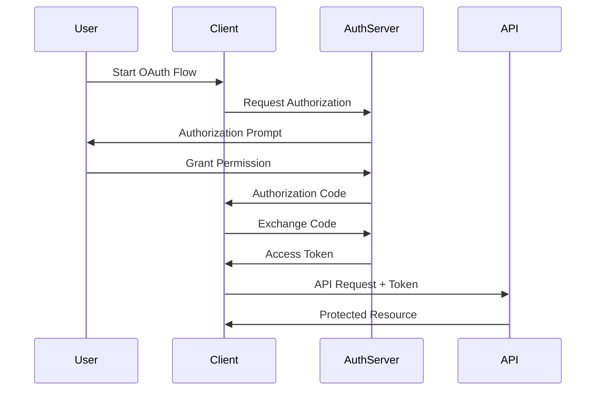

# API Design Fundamentals

<div align="center">
  
</div>

## Table of Contents
- [Introduction to APIs](#introduction-to-apis)
- [API Design Principles](#api-design-principles)
- [REST API Design](#rest-api-design)
- [GraphQL APIs](#graphql-apis)
- [API Security](#api-security)
- [API Documentation](#api-documentation)
- [Interview Tips](#interview-tips)

## Introduction to APIs

An API (Application Programming Interface) is a set of rules and protocols that allows different software applications to communicate with each other. Good API design is crucial for building scalable and maintainable distributed systems.

### Types of APIs
1. **REST APIs**
2. **GraphQL APIs**
3. **gRPC APIs**
4. **SOAP APIs**
5. **WebSocket APIs**

## API Design Principles

### 1. RESTful Principles
- **Resource-Based URLs**
- **HTTP Methods Usage**
- **Stateless Communication**
- **HATEOAS**

### 2. Design Best Practices

#### Naming Conventions
```
# Good Examples
GET /users
GET /users/{id}
POST /users
PUT /users/{id}
DELETE /users/{id}

# Bad Examples
GET /getUsers
POST /createUser
PUT /updateUser
DELETE /deleteUser
```

#### HTTP Methods
| Method | Usage | Example |
|--------|--------|---------|
| GET | Read resources | GET /articles |
| POST | Create resources | POST /articles |
| PUT | Update resources | PUT /articles/123 |
| DELETE | Remove resources | DELETE /articles/123 |
| PATCH | Partial updates | PATCH /articles/123 |

### 3. Response Formats

#### Success Response
```json
{
  "status": "success",
  "data": {
    "id": 123,
    "name": "John Doe",
    "email": "john@example.com"
  }
}
```

#### Error Response
```json
{
  "status": "error",
  "error": {
    "code": "USER_NOT_FOUND",
    "message": "User with ID 123 not found",
    "details": {
      "userId": 123
    }
  }
}
```

## REST API Design

### 1. Resource Modeling
```mermaid
graph LR
    A[API Client] --> B[/users]
    B --> C[/users/{id}]
    C --> D[/users/{id}/posts]
    D --> E[/users/{id}/posts/{postId}]
```

### 2. URL Structure
- Use nouns for resources
- Use plural forms
- Keep URLs simple and logical
- Use hierarchical relationships

### 3. Query Parameters
```
# Filtering
GET /users?role=admin

# Sorting
GET /users?sort=name:asc

# Pagination
GET /users?page=2&limit=10

# Field Selection
GET /users?fields=id,name,email
```

## GraphQL APIs

### 1. Schema Definition
```graphql
type User {
  id: ID!
  name: String!
  email: String!
  posts: [Post!]!
}

type Post {
  id: ID!
  title: String!
  content: String!
  author: User!
}

type Query {
  user(id: ID!): User
  users: [User!]!
  post(id: ID!): Post
}

type Mutation {
  createUser(name: String!, email: String!): User!
  updateUser(id: ID!, name: String, email: String): User!
}
```

### 2. Query Examples
```graphql
# Query
query {
  user(id: "123") {
    name
    email
    posts {
      title
    }
  }
}

# Mutation
mutation {
  createUser(name: "John", email: "john@example.com") {
    id
    name
    email
  }
}
```

## API Security

### 1. Authentication Methods
- **API Keys**
- **OAuth 2.0**
- **JWT Tokens**
- **Basic Auth**

### 2. Security Best Practices
- Use HTTPS
- Implement rate limiting
- Validate input
- Use proper error handling
- Implement access control

### 3. OAuth 2.0 Flow


## API Documentation

### 1. OpenAPI (Swagger) Example
```yaml
openapi: 3.0.0
info:
  title: User API
  version: 1.0.0
paths:
  /users:
    get:
      summary: Get all users
      responses:
        '200':
          description: List of users
          content:
            application/json:
              schema:
                type: array
                items:
                  $ref: '#/components/schemas/User'
components:
  schemas:
    User:
      type: object
      properties:
        id:
          type: integer
        name:
          type: string
```

### 2. Documentation Best Practices
- Keep it up to date
- Include examples
- Document error responses
- Provide authentication details
- Include rate limiting info

## Interview Tips

### 1. Common Interview Questions
1. How would you design a RESTful API for a social media platform?
2. Explain the differences between REST and GraphQL
3. How would you handle API versioning?
4. Design an authentication system for your API

### 2. Design Considerations
- Scalability
- Security
- Performance
- Maintainability
- Backwards compatibility

### 3. Best Practices to Remember
- Use proper HTTP status codes
- Implement proper error handling
- Design with backwards compatibility in mind
- Consider rate limiting and caching
- Document your API thoroughly

## Real-World Examples

### 1. Social Media API
```
GET /users/{id}
GET /users/{id}/posts
POST /posts
GET /posts/{id}/comments
```

### 2. E-commerce API
```
GET /products
GET /products/{id}
POST /orders
GET /orders/{id}
PUT /orders/{id}/status
```

## Further Reading
- [REST API Design Best Practices](https://restfulapi.net/)
- [GraphQL Documentation](https://graphql.org/)
- [OAuth 2.0 Simplified](https://www.oauth.com/)
- [OpenAPI Specification](https://swagger.io/specification/) 