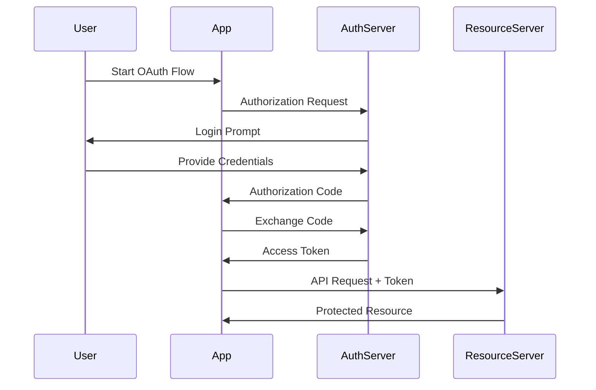

# Authentication & Authorization in System Design 📌

## Table of Contents

- [Introduction](#introduction)
- [Prerequisites & Related Topics](#prerequisites--related-topics)
- [Pattern Recognition Guide](#pattern-recognition-guide)
- [Authentication Methods](#authentication-methods)
- [Authorization Strategies](#authorization-strategies)
- [Security Best Practices](#security-best-practices)
- [Implementation Examples](#implementation-examples)
- [Trade-offs](#trade-offs)
- [Edge Cases to Consider](#edge-cases-to-consider)
- [Common Pitfalls](#common-pitfalls)
- [FAQ](#faq)
- [Interview Tips](#interview-tips)
- [Advanced Topics](#advanced-topics)
- [Further Reading](#further-reading)

## Introduction

Authentication verifies who a user is, while authorization determines what they can do. Together, they form the foundation of system security.

### Key Concepts
1. **Authentication (AuthN)**: Identity verification
2. **Authorization (AuthZ)**: Permission management
3. **Identity Management**: User lifecycle
4. **Access Control**: Resource protection

## Prerequisites & Related Topics

- Builds on: HTTP basics, tokens and cookies
- Used in: [API Security](../security/api-security.md), [OAuth & OIDC](../security/oauth-openid.md), [Zero Trust](../security/zero-trust.md)
- Techniques often combined: JWTs, MFA, RBAC/ABAC, secret rotation
- See also: [Secrets Management](../security/secrets-management.md) — machine auth uses the same principles

## Pattern Recognition Guide

### 🎯 When to Use Authentication & Authorization

**Keywords in requirements**: "login", "who is the user", "permissions", "roles", "SSO", "session", "token", "access control"
**Reach for this when**:
- Any request that must be tied to a verified identity
- Multi-tenant systems where data isolation is enforced per principal
- Delegating access to third-party apps (OAuth scopes)
- Privileged operations requiring step-up verification

### 🔑 Approach Indicators

| Approach | Signals | Best For |
|----------|---------|----------|
| Session cookies | browser apps, revocable server state | traditional web apps |
| JWT bearer | stateless verification, cross-service | APIs and microservices |
| OAuth 2.0/OIDC | delegated or federated login | SSO, third-party integrations |
| RBAC | permission sets per role | org-tooling semantics |
| ABAC | attribute/policy-driven decisions | fine-grained data rules |

### ❌ When NOT to Use

- Building your own crypto or password hashing — use bcrypt/argon2 and proven libs
- Long-lived static tokens in browsers — short-lived access + refresh
- Permissions hard-coded in handlers — policy must be data, not code

## Authentication Methods

### 1. Password-Based Authentication
**How it works — Password auth:** hash with a slow adaptive function (bcrypt/argon2), compare in constant time, rate-limit attempts, and step up to MFA for sensitive actions — the password check is deliberately the slowest part of login.

### 2. JWT Authentication
**How it works — JWT auth:** verify signature and expiry on every request, check issuer/audience, then trust the claims — stateless auth with zero session lookups; revocation is handled with short TTLs plus a denylist.

### 3. OAuth 2.0 Flow

### 4. Multi-Factor Authentication
**How it works — MFA flow:** after the password check, a second factor (TOTP, WebAuthn key) is verified server-side; WebAuthn is phishing-resistant because the challenge is bound to the origin — TOTP as the baseline, WebAuthn for privileged users.

## Authorization Strategies

### 1. Role-Based Access Control (RBAC)
**How it works — RBAC system:** users hold roles, roles hold permissions, tokens carry role claims; changes propagate through the token refresh or a versioned policy cache — the whole model is data, so every grant is auditable.

### 2. Attribute-Based Access Control (ABAC)
**How it works — ABAC system:** user, resource, and environment attributes feed a central policy engine (OPA/XACML-style); decisions are logged with the inputs that produced them — debuggable authorization instead of scattered if-statements.

### 3. Token-Based Authorization
**How it works — Token auth:** the bearer token *is* the credential — whoever holds it is authenticated — so TLS only, short lifetimes, and scopes limited to what the client actually needs.

## Security Best Practices

### 1. Password Security
**How it works — Password policy:** modern guidance: length over complexity, check against breached-password lists, rate-limit brute force, and store only adaptive hashes (argon2/bcrypt) — complexity rules make passwords worse, not better.

### 2. Rate Limiting
**How it works — Rate limiter:** identify the caller (IP, user, API key), check their window/counter against the policy, and return 429 with retry-after headers when exceeded — enforce centrally (or with shared state) so the limit is global, not per-instance.

### 3. Session Management
**How it works — Session manager:** sessions live server-side (or as signed tokens) with rotation on privilege change, absolute and idle expiry, and revocation on logout — the session store is the single place that decides who is "logged in".

## Implementation Examples

### 1. API Authentication
**Endpoint: POST /api/login** — validates the request, applies business logic, and returns a typed response.

### 2. Role-Based API
**Endpoint: GET /api/admin** — validates the request, applies business logic, and returns a typed response.

## Trade-offs

| Approach | Pros | Cons | Best For |
|----------|------|------|----------|
| Server-side sessions | Instant revocation, small tokens, simple mental model | Session store becomes shared state; scaling and cross-service auth harder | Traditional monoliths, high-security apps |
| JWT (stateless) | No lookup per request, easy horizontal scaling | Hard revocation, token size, clock/skew issues | Microservices, API-to-API auth |
| SSO / OAuth delegation | One login across products, centralized policy | Added complexity, dependency on identity provider | Multi-product platforms, B2B apps |

**Security vs convenience:** Longer session lifetimes improve UX but widen the window for stolen credentials; MFA and short refresh windows trade convenience for safety.

**Centralization vs autonomy:** A central authorization service gives consistent policy but adds a dependency; service-level checks are resilient but drift over time.

> **⚠️ When NOT to use JWTs:** when you need instant revocation (stolen token, banned user, logout-everywhere), strict per-session audit, or sessions shorter than a token's natural lifetime — a server-side session store serves these better despite the lookup cost.

## Edge Cases to Consider

- Clock skew between issuer and verifier — allow leeway, but bound it
- Token stolen before expiry — denylists plus short TTLs limit damage
- Session fixation after login — rotate session IDs on privilege change
- Service accounts outliving their owners — lifecycle and review required
- Downstream revocation — services must re-check policy, not just the signature

## Common Pitfalls

1. Storing plaintext or weakly-hashed passwords
2. Trusting unverified JWT claims from any issuer
3. Permissions checked only in the UI
4. No rate limiting on login — credential stuffing wins
5. Skipping MFA for admin access

## FAQ

**Q1: Sessions or JWTs?**

A: Sessions for revocation control and browser apps; JWTs for stateless scale across services. Many systems issue short-lived JWTs plus a server-side refresh/revocation path.

**Q2: Where is authorization enforced?**

A: At every trust boundary — gateway coarse checks, service fine checks, database row-level last line. UI checks are UX, not security.

**Q3: How do services authenticate to each other?**

A: Workload identity with short-lived credentials (mTLS certs or signed tokens), issued by the platform — never shared static secrets.

## Interview Tips

### 1. Key Considerations
- Security requirements
- Scalability needs
- User experience
- Compliance requirements
- Performance impact

### 2. Common Questions
1. How would you implement secure password storage?
2. Explain OAuth 2.0 flow and its components
3. How do you handle session management?
4. Design an RBAC system

### 3. Best Practices
- Use secure protocols (HTTPS)
- Implement proper password hashing
- Enable MFA where possible
- Regular security audits
- Monitor for suspicious activity

## Advanced Topics

1. WebAuthn/passkeys — phishing-resistant, origin-bound factors
2. Short-lived workload identity (SPIFFE-style) for service-to-service
3. Centralized policy engines (OPA) with decision logging
4. Step-up authentication flows for sensitive operations

## Further Reading
- [OWASP Authentication Cheatsheet](https://cheatsheetseries.owasp.org/cheatsheets/Authentication_Cheat_Sheet.html)
- [OAuth 2.0 Specification](https://oauth.net/2/)
- [JWT Best Practices](https://auth0.com/blog/a-look-at-the-latest-draft-for-jwt-bcp/)
- [NIST Authentication Guidelines](https://pages.nist.gov/800-63-3/) 