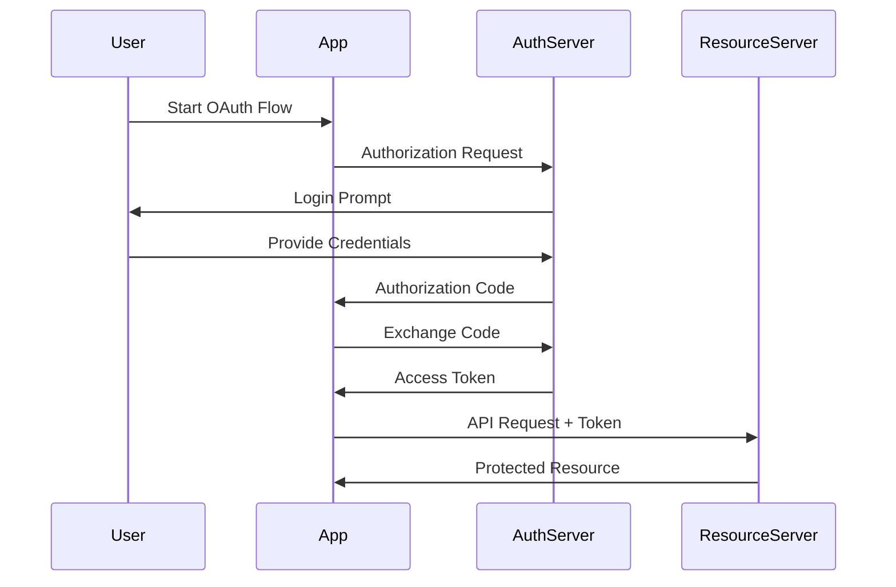

# Authentication & Authorization

## Table of Contents
- [Introduction](#introduction)
- [Authentication Methods](#authentication-methods)
- [Authorization Strategies](#authorization-strategies)
- [Security Best Practices](#security-best-practices)
- [Implementation Examples](#implementation-examples)
- [Interview Tips](#interview-tips)

## Introduction

Authentication verifies who a user is, while authorization determines what they can do. Together, they form the foundation of system security.

### Key Concepts
1. **Authentication (AuthN)**: Identity verification
2. **Authorization (AuthZ)**: Permission management
3. **Identity Management**: User lifecycle
4. **Access Control**: Resource protection

## Authentication Methods

### 1. Password-Based Authentication
```python
class PasswordAuth:
    def hash_password(self, password):
        """Hash password using bcrypt."""
        salt = bcrypt.gensalt()
        return bcrypt.hashpw(password.encode(), salt)
    
    def verify_password(self, password, hashed):
        """Verify password against hash."""
        return bcrypt.checkpw(password.encode(), hashed)
    
    def authenticate(self, username, password):
        """Authenticate user."""
        user = db.get_user(username)
        if not user:
            return None
        if self.verify_password(password, user.password):
            return user
        return None
```

### 2. JWT Authentication
```python
class JWTAuth:
    def generate_token(self, user_id, claims=None):
        """Generate JWT token."""
        payload = {
            'sub': user_id,
            'iat': datetime.utcnow(),
            'exp': datetime.utcnow() + timedelta(days=1)
        }
        if claims:
            payload.update(claims)
        return jwt.encode(payload, SECRET_KEY, algorithm='HS256')
    
    def verify_token(self, token):
        """Verify JWT token."""
        try:
            payload = jwt.decode(token, SECRET_KEY, algorithms=['HS256'])
            return payload
        except jwt.ExpiredSignatureError:
            raise AuthError('Token expired')
        except jwt.InvalidTokenError:
            raise AuthError('Invalid token')
```

### 3. OAuth 2.0 Flow


### 4. Multi-Factor Authentication
```python
class MFAAuth:
    def generate_totp(self, secret):
        """Generate TOTP code."""
        return pyotp.TOTP(secret).now()
    
    def verify_totp(self, secret, code):
        """Verify TOTP code."""
        return pyotp.TOTP(secret).verify(code)
    
    def authenticate(self, username, password, mfa_code):
        """Authenticate with MFA."""
        user = self.verify_credentials(username, password)
        if not user:
            return None
        if self.verify_totp(user.mfa_secret, mfa_code):
            return user
        return None
```

## Authorization Strategies

### 1. Role-Based Access Control (RBAC)
```python
class RBACSystem:
    def check_permission(self, user, resource, action):
        """Check if user has permission."""
        user_roles = self.get_user_roles(user)
        required_permissions = self.get_required_permissions(resource, action)
        
        return any(
            role.has_permissions(required_permissions)
            for role in user_roles
        )
    
    def get_user_roles(self, user):
        """Get user's roles."""
        return db.get_user_roles(user.id)
    
    def get_required_permissions(self, resource, action):
        """Get required permissions for action."""
        return db.get_resource_permissions(resource, action)
```

### 2. Attribute-Based Access Control (ABAC)
```python
class ABACSystem:
    def evaluate_policy(self, user, resource, action, context):
        """Evaluate ABAC policy."""
        policy = self.get_applicable_policy(resource, action)
        
        return policy.evaluate({
            'user': user.attributes,
            'resource': resource.attributes,
            'action': action,
            'context': context
        })
    
    def get_applicable_policy(self, resource, action):
        """Get applicable policy."""
        return db.get_policy(resource.type, action)
```

### 3. Token-Based Authorization
```python
class TokenAuth:
    def create_access_token(self, user, scope):
        """Create access token with scope."""
        return {
            'token': self.generate_token(user.id),
            'scope': scope,
            'expires_at': datetime.utcnow() + timedelta(hours=1)
        }
    
    def verify_scope(self, token, required_scope):
        """Verify token has required scope."""
        token_data = self.decode_token(token)
        return required_scope in token_data['scope']
```

## Security Best Practices

### 1. Password Security
```python
class PasswordPolicy:
    def validate_password(self, password):
        """Validate password strength."""
        return (
            len(password) >= 8 and
            any(c.isupper() for c in password) and
            any(c.islower() for c in password) and
            any(c.isdigit() for c in password) and
            any(not c.isalnum() for c in password)
        )
    
    def check_common_passwords(self, password):
        """Check against common passwords."""
        return not db.is_common_password(password)
```

### 2. Rate Limiting
```python
class RateLimiter:
    def __init__(self, redis_client):
        self.redis = redis_client
    
    def is_rate_limited(self, key, limit, window):
        """Check if rate limited."""
        current = self.redis.get(key) or 0
        if int(current) >= limit:
            return True
        
        pipe = self.redis.pipeline()
        pipe.incr(key)
        pipe.expire(key, window)
        pipe.execute()
        return False
```

### 3. Session Management
```python
class SessionManager:
    def create_session(self, user):
        """Create new session."""
        session_id = self.generate_session_id()
        session_data = {
            'user_id': user.id,
            'created_at': datetime.utcnow(),
            'expires_at': datetime.utcnow() + timedelta(hours=24)
        }
        self.store_session(session_id, session_data)
        return session_id
    
    def validate_session(self, session_id):
        """Validate session."""
        session = self.get_session(session_id)
        if not session:
            return False
        return datetime.utcnow() < session['expires_at']
```

## Implementation Examples

### 1. API Authentication
```python
@app.route('/api/login', methods=['POST'])
def login():
    data = request.get_json()
    user = authenticate_user(data['username'], data['password'])
    if not user:
        return jsonify({'error': 'Invalid credentials'}), 401
    
    token = create_access_token(user)
    return jsonify({
        'token': token,
        'user': user.to_dict()
    })

@app.route('/api/protected', methods=['GET'])
@require_auth
def protected_route():
    user = g.current_user
    return jsonify({'message': f'Hello {user.username}'})
```

### 2. Role-Based API
```python
class UserRoles(Enum):
    ADMIN = 'admin'
    USER = 'user'
    GUEST = 'guest'

def require_role(role):
    def decorator(f):
        @wraps(f)
        def wrapped(*args, **kwargs):
            if not g.current_user.has_role(role):
                return jsonify({'error': 'Unauthorized'}), 403
            return f(*args, **kwargs)
        return wrapped
    return decorator

@app.route('/api/admin', methods=['GET'])
@require_auth
@require_role(UserRoles.ADMIN)
def admin_route():
    return jsonify({'message': 'Admin access granted'})
```

## Interview Tips

### 1. Key Considerations
- Security requirements
- Scalability needs
- User experience
- Compliance requirements
- Performance impact

### 2. Common Questions
1. How would you implement secure password storage?
2. Explain OAuth 2.0 flow and its components
3. How do you handle session management?
4. Design an RBAC system

### 3. Best Practices
- Use secure protocols (HTTPS)
- Implement proper password hashing
- Enable MFA where possible
- Regular security audits
- Monitor for suspicious activity

## Further Reading
- [OWASP Authentication Cheatsheet](https://cheatsheetseries.owasp.org/cheatsheets/Authentication_Cheat_Sheet.html)
- [OAuth 2.0 Specification](https://oauth.net/2/)
- [JWT Best Practices](https://auth0.com/blog/a-look-at-the-latest-draft-for-jwt-bcp/)
- [NIST Authentication Guidelines](https://pages.nist.gov/800-63-3/) 