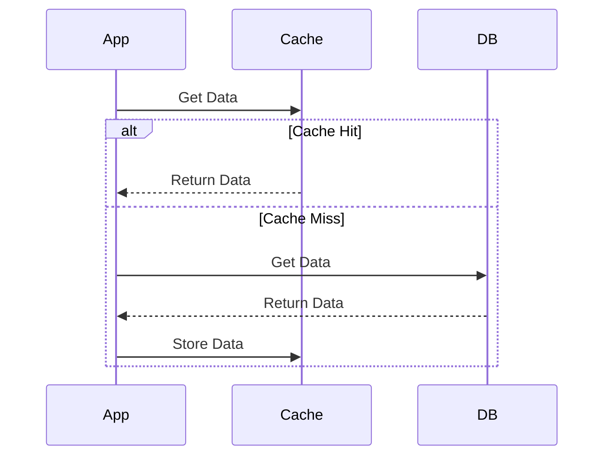
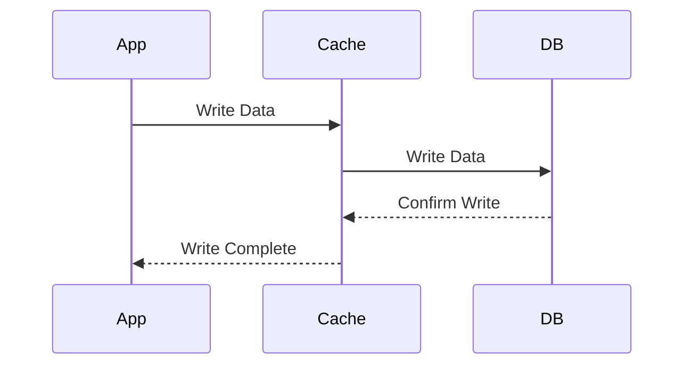
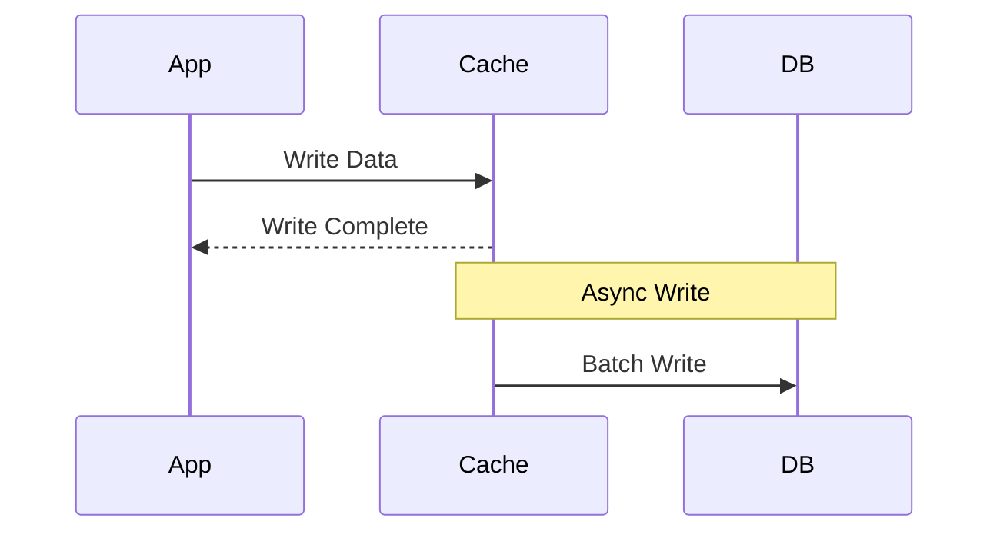
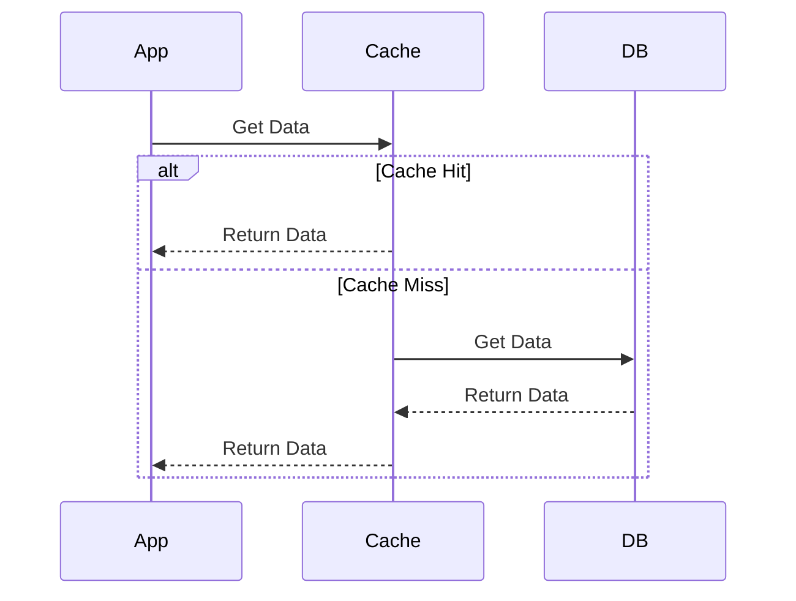
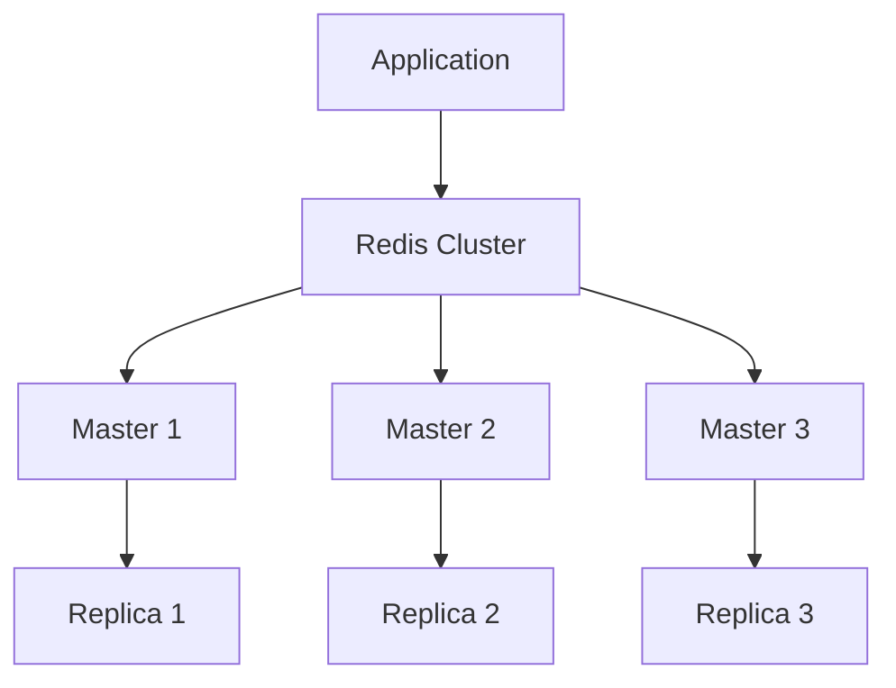

# Caching Fundamentals

<div align="center">
  
</div>

## Table of Contents
- [Introduction to Caching](#introduction-to-caching)
- [Caching Strategies](#caching-strategies)
- [Cache Types](#cache-types)
- [Cache Eviction Policies](#cache-eviction-policies)
- [Distributed Caching](#distributed-caching)
- [Common Use Cases](#common-use-cases)
- [Interview Tips](#interview-tips)

## Introduction to Caching

Caching is a technique that stores copies of frequently accessed data in a faster storage layer to improve system performance and reduce load on the primary data source.

### Benefits of Caching
1. **Improved Performance**
2. **Reduced Latency**
3. **Lower Database Load**
4. **Better Scalability**
5. **Cost Efficiency**

## Caching Strategies

### 1. Cache-Aside (Lazy Loading)


### 2. Write-Through


### 3. Write-Behind (Write-Back)


### 4. Read-Through


## Cache Types

### 1. Application Cache
- In-memory caching
- Local to application
- Fast access
- Limited by memory

### 2. Distributed Cache
- Shared across multiple nodes
- Scalable
- Consistent
- Examples: Redis, Memcached

### 3. CDN Cache
- Geographic distribution
- Static content
- Edge locations
- Global scale

### 4. Browser Cache
- Client-side storage
- HTTP caching headers
- Local storage
- Service workers

## Cache Eviction Policies

### 1. LRU (Least Recently Used)
```python
class LRUCache:
    def __init__(self, capacity):
        self.capacity = capacity
        self.cache = OrderedDict()
    
    def get(self, key):
        if key not in self.cache:
            return -1
        self.cache.move_to_end(key)
        return self.cache[key]
    
    def put(self, key, value):
        if key in self.cache:
            self.cache.move_to_end(key)
        self.cache[key] = value
        if len(self.cache) > self.capacity:
            self.cache.popitem(last=False)
```

### 2. LFU (Least Frequently Used)
- Tracks frequency of access
- Removes least used items
- Maintains count per item

### 3. FIFO (First In First Out)
- Simple queue structure
- Removes oldest items
- Easy to implement

### 4. Random Replacement
- Random eviction
- Low overhead
- Unpredictable performance

## Distributed Caching

### 1. Redis Architecture


### 2. Consistency Patterns
- **Strong Consistency**
  - Immediate updates
  - Higher latency
  - Synchronous operations

- **Eventual Consistency**
  - Async updates
  - Better performance
  - Possible stale data

### 3. Partitioning Strategies
- **Range Based**
- **Hash Based**
- **Consistent Hashing**

## Common Use Cases

### 1. Database Query Caching
```sql
-- Before Caching
SELECT * FROM products WHERE category = 'electronics';

-- With Redis Cache
GET cache:products:electronics
SET cache:products:electronics [results] EX 3600
```

### 2. Session Storage
```javascript
// Store session
await redis.set(`session:${userId}`, sessionData, 'EX', 3600);

// Retrieve session
const session = await redis.get(`session:${userId}`);
```

### 3. API Response Caching
```python
def get_user_profile(user_id):
    cache_key = f"user:{user_id}"
    
    # Try cache first
    profile = cache.get(cache_key)
    if profile:
        return profile
        
    # Cache miss - get from DB
    profile = db.get_user(user_id)
    cache.set(cache_key, profile, ex=3600)
    return profile
```

### 4. Content Caching
```nginx
# Nginx Caching Configuration
proxy_cache_path /path/to/cache levels=1:2 keys_zone=my_cache:10m;

location / {
    proxy_cache my_cache;
    proxy_cache_use_stale error timeout http_500 http_502 http_503 http_504;
    proxy_cache_valid 200 60m;
}
```

## Interview Tips

### 1. System Design Considerations
- Cache size and eviction
- Data consistency
- Cache invalidation
- Cost vs benefit
- Failure handling

### 2. Common Questions
1. How would you implement a distributed cache?
2. When should you not use caching?
3. How do you handle cache consistency?
4. Design a caching system for a social media feed

### 3. Best Practices
- Cache judiciously
- Monitor hit rates
- Set TTL values
- Plan for failures
- Consider memory usage

## Real-World Examples

### 1. E-commerce Product Cache
```python
def get_product(product_id):
    cache_key = f"product:{product_id}"
    
    # Check cache
    product = cache.get(cache_key)
    if product:
        return product
    
    # Cache miss
    product = db.get_product(product_id)
    if product:
        cache.set(cache_key, product, ex=3600)
    return product
```

### 2. Social Media Feed Cache
```python
def get_user_feed(user_id):
    cache_key = f"feed:{user_id}"
    
    # Try cache
    feed = cache.get(cache_key)
    if feed:
        return feed
    
    # Generate feed
    feed = generate_user_feed(user_id)
    cache.set(cache_key, feed, ex=300)  # 5 minutes
    return feed
```

## Further Reading
- [Caching Best Practices](https://aws.amazon.com/caching/best-practices/)
- [Redis Documentation](https://redis.io/documentation)
- [CDN Caching](https://www.cloudflare.com/learning/cdn/what-is-caching/)
- [Browser Caching](https://web.dev/http-cache/) 