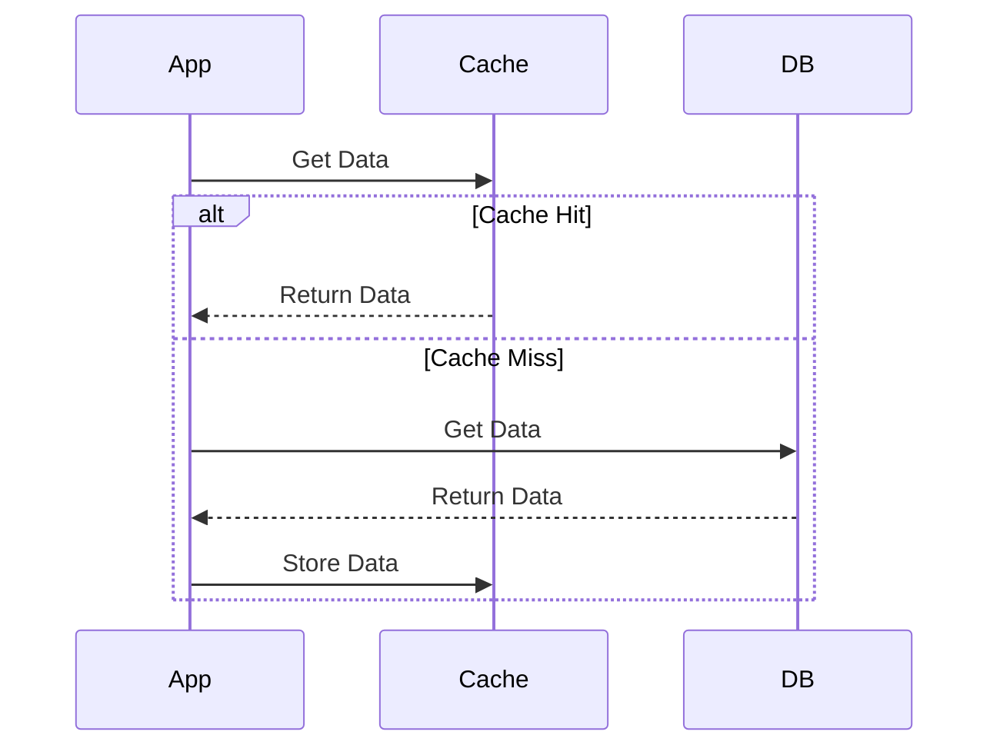
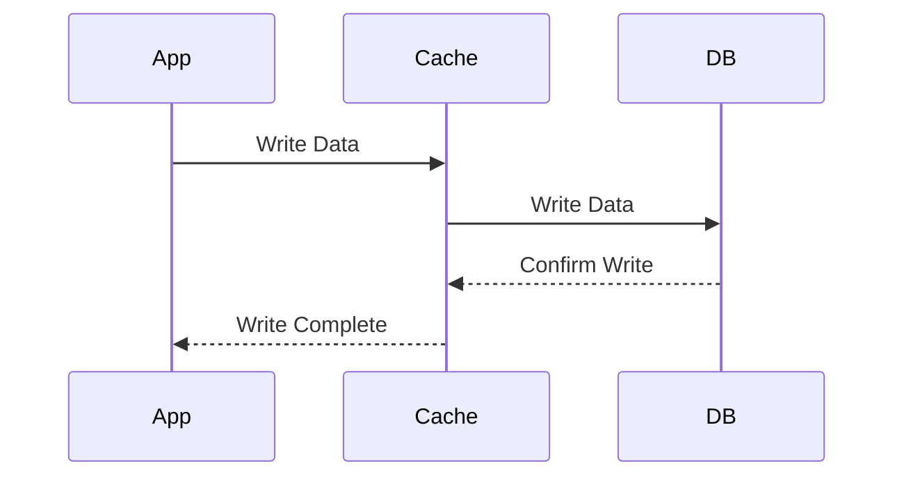
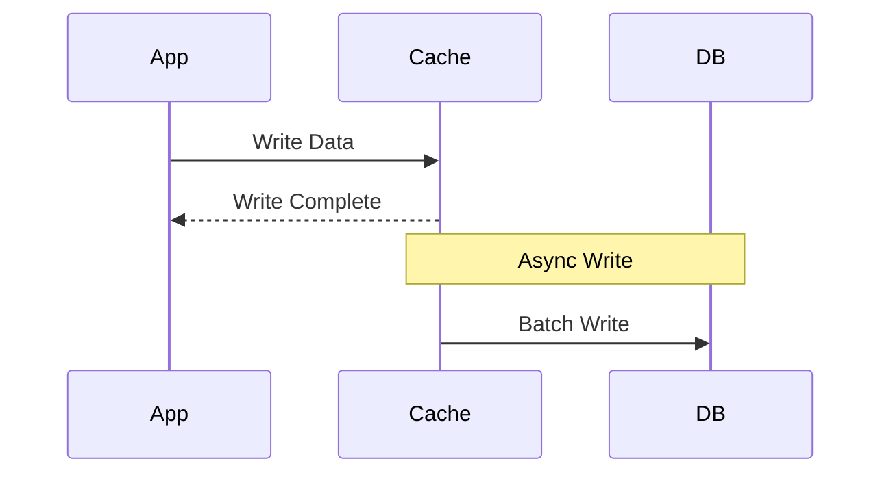
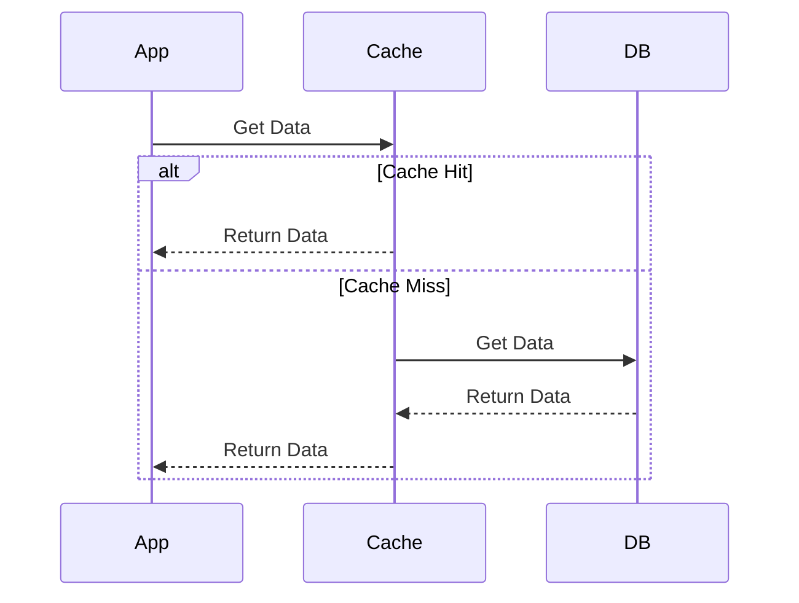
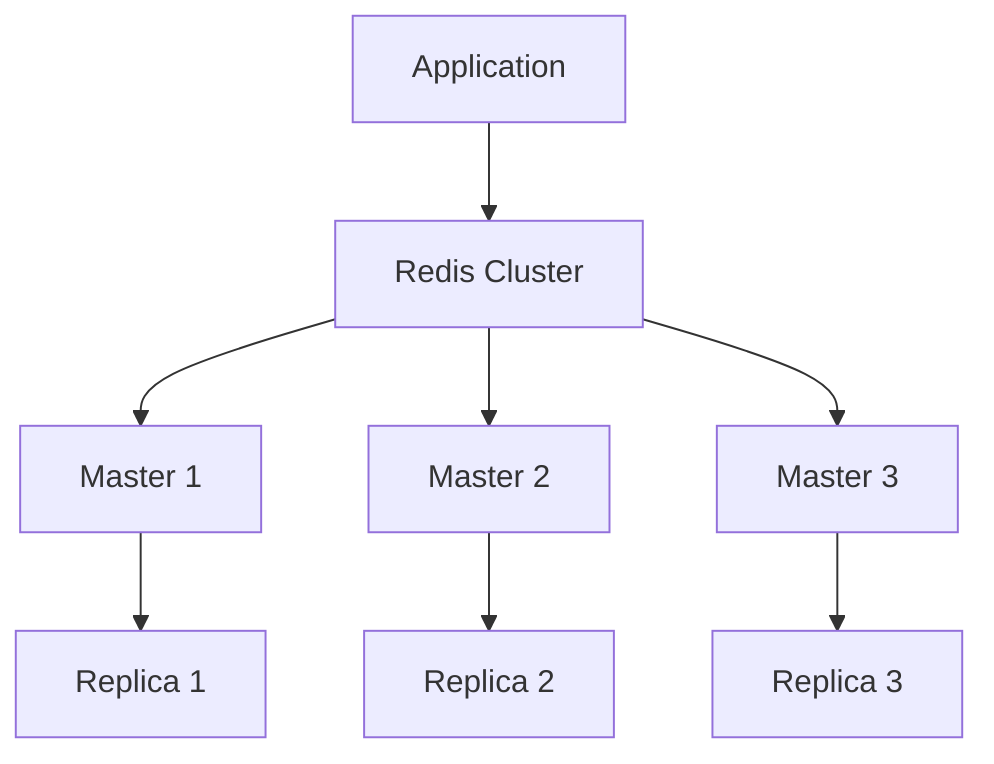

# Caching in System Design 📌

## Table of Contents

- [Introduction to Caching](#introduction-to-caching)
- [Prerequisites & Related Topics](#prerequisites--related-topics)
- [Pattern Recognition Guide](#pattern-recognition-guide)
- [Caching Strategies](#caching-strategies)
- [Cache Types](#cache-types)
- [Cache Eviction Policies](#cache-eviction-policies)
- [Distributed Caching](#distributed-caching)
- [Common Use Cases](#common-use-cases)
- [Trade-offs](#trade-offs)
- [Edge Cases to Consider](#edge-cases-to-consider)
- [Common Pitfalls](#common-pitfalls)
- [FAQ](#faq)
- [Interview Tips](#interview-tips)
- [Real-World Examples](#real-world-examples)
- [Advanced Topics](#advanced-topics)
- [Further Reading](#further-reading)

## Introduction to Caching

Caching is a technique that stores copies of frequently accessed data in a faster storage layer to improve system performance and reduce load on the primary data source.

### Benefits of Caching
1. **Improved Performance**
2. **Reduced Latency**
3. **Lower Database Load**
4. **Better Scalability**
5. **Cost Efficiency**

## Prerequisites & Related Topics

- **Builds on**: hashing (key distribution), Consistent Hashing (cache clusters)
- **Used in**: [Indexing](indexing.md) (covering indexes are read-path caching), [Database Sharding](database-sharding.md), CDN & Content Delivery
- **Techniques often combined**: TTLs, cache-aside reads, invalidation events, stampede protection
- **See also**: [Message Queues](../architecture/message-queues.md) (async invalidation fan-out)

## Pattern Recognition Guide

### 🎯 When to Use Caching

**Keywords in requirements**: "read-heavy", "latency", "hot data", "reduce database load", "frequently accessed", "expensive computation"
**Reach for this when**:
- Read-to-write ratio is high (10:1 or more)
- Users tolerate seconds-stale data
- A computation or query is expensive and repeated
- Protecting the database from hotspots or stampedes

### 🔑 Approach Indicators

| Approach | Signals | Best For |
|----------|---------|----------|
| Cache-Aside | app reads cache first, fills on miss | the default for read paths |
| Read-Through | cache library fills misses transparently | shared data-access layers |
| Write-Through | write cache + DB together | consistency-sensitive reads |
| Write-Behind | ack fast, flush async | counters, write-heavy telemetry |
| TTL + LRU | bounded memory, recency matters | sessions, API responses |

### ❌ When NOT to Use

- Strongly-consistent data — balances, inventory commitments → read [Database Sharding](database-sharding.md) trade-offs instead
- Write-heavy keys with low hit rates — you pay invalidation for nothing
- Cold data — cache memory is a budget; evicting hot items for cold ones hurts

## Caching Strategies

### 1. Cache-Aside (Lazy Loading)

### 2. Write-Through

### 3. Write-Behind (Write-Back)

### 4. Read-Through

## Cache Types

### 1. Application Cache
- In-memory caching
- Local to application
- Fast access
- Limited by memory

### 2. Distributed Cache
- Shared across multiple nodes
- Scalable
- Consistent
- Examples: Redis, Memcached

### 3. CDN Cache
- Geographic distribution
- Static content
- Edge locations
- Global scale

### 4. Browser Cache
- Client-side storage
- HTTP caching headers
- Local storage
- Service workers

## Cache Eviction Policies

### 1. LRU (Least Recently Used)
**How it works — LRU eviction:** the cache keeps a doubly-linked list ordered by recency plus a hash map for O(1) lookup. Every hit moves the entry to the front ("most recently used"); when capacity is exceeded, the entry at the tail is evicted. Interview tip: this is the classic O(1) get/put structure — be able to sketch the map-into-list pointer dance.

### 2. LFU (Least Frequently Used)
- Tracks frequency of access
- Removes least used items
- Maintains count per item

### 3. FIFO (First In First Out)
- Simple queue structure
- Removes oldest items
- Easy to implement

### 4. Random Replacement
- Random eviction
- Low overhead
- Unpredictable performance

## Distributed Caching

### 1. Redis Architecture

### 2. Consistency Patterns
- **Strong Consistency**
  - Immediate updates
  - Higher latency
  - Synchronous operations

- **Eventual Consistency**
  - Async updates
  - Better performance
  - Possible stale data

### 3. Partitioning Strategies
- **Range Based**
- **Hash Based**
- **Consistent Hashing**

## Common Use Cases

### 1. Database Query Caching
**Config lever:** raising memory/connection settings scales a single node vertically — effective until the hardware ceiling.

### 2. Session Storage
**How it works — Session store:** on login, write `session:<userId>` with a 3600-second TTL; every request reads it back with a single key lookup. Redis expires entries itself, so stale sessions disappear without any cleanup job.

### 3. API Response Caching
**How it works — API response cache:** key the cache by the full request identity — method + path + relevant query params (`user:123:profile`) — and store the serialized response with a short TTL. On a hit, serve the stored bytes and skip the database entirely; a cache miss costs one origin call, then repopulates. Watch for per-user data: never let one user's response be served under another user's key.

### 4. Content Caching
**How it works — content caching:** static and semi-static content is cached at the edge — a CDN or reverse-proxy layer sits in front of the origin, serves cacheable assets (images, JS, product pages) from disk/memory near the user, and only forwards cache misses. Cache-Control headers drive freshness (`max-age` sets TTL, `stale-while-revalidate` serves stale while refreshing in the background), so origin traffic drops by an order of magnitude for public content.

## Trade-offs

| Strategy | Pros | Cons | Best For |
|----------|------|------|----------|
| Cache-aside | Simple, only requested data cached, resilient to cache loss | First-request latency (miss), stale data risk | General read-heavy workloads |
| Read-through | Cache stays warm, app code simplified | Added cache-layer complexity | Predictable read patterns |
| Write-through | Cache and DB always consistent | Write latency, caching data never read | Read-heavy data with strict consistency |
| Write-behind | Lowest write latency, write batching | Data loss risk on crash, complexity | Write-heavy, loss-tolerant data |

**Freshness vs hit rate:** Shorter TTLs serve fresher data but lower hit rates; longer TTLs boost performance but risk staleness.

**Performance vs consistency:** Caching fundamentally trades consistency guarantees for latency and load reduction — invalidation strategy determines where you land.

**Memory vs cost:** Larger caches raise hit rates with diminishing returns; monitor hit rate to size the cache economically.

> **⚠️ When NOT to cache:** write-heavy data with low hit rates, data that must be strongly consistent (balances, inventory commitments), and query patterns with poor key locality — invalidation cost then exceeds the read savings.

## Edge Cases to Consider

- Hot key expires under load → stampede; use locks or probabilistic early refresh
- Cold start after deploy — pre-warm keys that are predictably hot
- One user's data served under another's key — key scoping bugs
- Clock skew across cache nodes affecting TTLs
- Invalidation message lost — TTL is the backstop; always set one

## Common Pitfalls

1. Adding a cache without a hit-rate target — measure before and after
2. Unbounded or very long TTLs — stale data becomes a correctness bug
3. No stampede protection on hot keys
4. Caching authenticated responses in shared layers
5. Assuming invalidation is solved — it is the hard part, plan it

## FAQ

**Q1: Cache-aside or write-through?**

A: Cache-aside for reads with TTLs (simple, resilient); write-through when reads must always see the latest write and you can afford synchronous write latency.

**Q2: How do I pick a TTL?**

A: From business tolerance for staleness, not vibes: how many seconds of stale price/stock/profile is acceptable? Set TTL below that and rely on invalidation for correctness.

**Q3: Cache or replica?**

A: Replicas scale full reads with strong-ish consistency; caches scale hot reads with staleness. Read-heavy hotspots → cache first; general read scaling → replicas.

## Interview Tips

### 1. System Design Considerations
- Cache size and eviction
- Data consistency
- Cache invalidation
- Cost vs benefit
- Failure handling

### 2. Common Questions
1. How would you implement a distributed cache?
2. When should you not use caching?
3. How do you handle cache consistency?
4. Design a caching system for a social media feed

### 3. Best Practices
- Cache judiciously
- Monitor hit rates
- Set TTL values
- Plan for failures
- Consider memory usage

## Real-World Examples

### 1. E-commerce Product Cache
**How it works — Product cache:** product detail pages are read-heavy (1000:1) and change slowly, so cache `product:<id>` for minutes with cache-aside: miss → read the database → populate with TTL. Price or stock changes publish an invalidation event so the next read re-fetches — correctness where it matters, speed everywhere else.

### 2. Social Media Feed Cache
**How it works — Feed cache:** the expensive part of a feed is the fan-out query, so cache the assembled feed (`feed:<userId>`, latest N post IDs) and regenerate lazily on expiry or on a new-post event. Celebrity accounts with millions of followers are the exception — their posts fan out on read instead of pre-writing to every follower's cache.

## Advanced Topics

1. **Stampede locks & probabilistic early expiry** (XFetch-style)
2. **Tiered caching** — L1 in-process, L2 Redis, L3 CDN
3. **Cache warming / precomputation** for predictable peaks
4. **CDN edge caching** with stale-while-revalidate semantics

## Further Reading
- [Caching Best Practices](https://aws.amazon.com/caching/best-practices/)
- [Redis Documentation](https://redis.io/documentation)
- [CDN Caching](https://www.cloudflare.com/learning/cdn/what-is-caching/)
- [Browser Caching](https://web.dev/http-cache/) 
