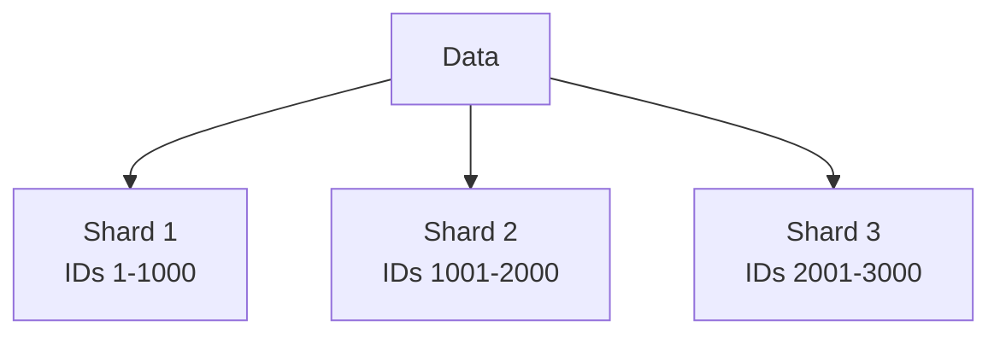
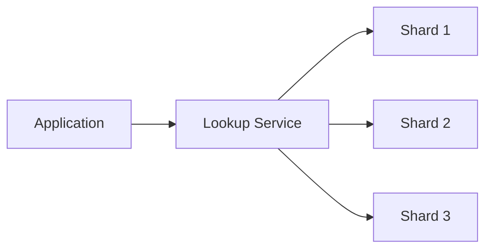

# Database Sharding in System Design 📌

## Table of Contents

- [Introduction to Sharding](#introduction-to-sharding)
- [Prerequisites & Related Topics](#prerequisites--related-topics)
- [Pattern Recognition Guide](#pattern-recognition-guide)
- [Sharding Strategies](#sharding-strategies)
- [Partitioning Methods](#partitioning-methods)
- [Sharding Challenges](#sharding-challenges)
- [Implementation Examples](#implementation-examples)
- [Trade-offs](#trade-offs)
- [Edge Cases to Consider](#edge-cases-to-consider)
- [Common Pitfalls](#common-pitfalls)
- [FAQ](#faq)
- [Interview Tips](#interview-tips)
- [Real-World Examples](#real-world-examples)
- [Advanced Topics](#advanced-topics)
- [Further Reading](#further-reading)

## Introduction to Sharding

Database sharding is a technique for breaking up a large database into smaller, more manageable pieces called shards. Each shard contains a subset of the data and is hosted on a separate database server instance.

### Benefits of Sharding
1. **Improved Performance**
2. **Better Scalability**
3. **Higher Availability**
4. **Reduced Query Load**

## Prerequisites & Related Topics

- **Builds on**: [Indexing](indexing.md), partitioning basics
- **Used in**: multi-tenant SaaS data isolation, globally distributed data, write-heavy platforms
- **Techniques often combined**: Consistent Hashing (placement), CQRS (cross-shard reads), sagas (cross-shard transactions)
- **See also**: [Scaling Types](../scalability/scaling-types.md) (sharding is the last resort, not the first)

## Pattern Recognition Guide

### 🎯 When to Use Database Sharding

**Keywords in requirements**: "scale writes", "data too large", "partition data", "tenant isolation", "horizontal database scaling"
**Reach for this when**:
- Write throughput exceeds what one primary can absorb
- Dataset size exceeds practical single-node storage or working memory
- Regulatory residency requires data to live in specific regions
- Blast-radius isolation per tenant or per geography

### 🔑 Approach Indicators

| Approach | Signals | Best For |
|----------|---------|----------|
| Hash sharding | even distribution, point lookups | user-scoped data |
| Range sharding | range scans matter | time-series |
| Directory sharding | flexible remapping | multi-tenant SaaS |
| Geo sharding | latency/residency | global applications |

### ❌ When NOT to Use

- Reads are the bottleneck → [read replicas and caching](../scalability/scaling-types.md) first
- Single node still has headroom — indexes, partitions, and caches are cheaper than shards
- Queries demand heavy cross-shard joins — denormalize or rethink before sharding

## Sharding Strategies

### 1. Range-Based Sharding

Example Implementation:
**`customers_1` table:**

| Column | Type |
|--------|------|
| id | INT PRIMARY KEY |
| name | VARCHAR(255) |
| id | INT PRIMARY KEY |
| name | VARCHAR(255) |

Primary key: `id`. Keep the schema description in interviews to keys and access patterns, not column lists.

### 2. Hash-Based Sharding
**How it works — Sharded database:** Route each record to its partition by the shard key, so most queries touch exactly one partition — and hot spots, cross-partition joins, and rebalancing are the costs you sign up for.

### 3. Directory-Based Sharding

## Partitioning Methods

### 1. Horizontal Partitioning (Sharding)
**`orders_2023` table:**

| Column | Type |
|--------|------|
| order_id | INT PRIMARY KEY |
| customer_id | INT |
| order_date | DATE |
| order_id | INT PRIMARY KEY |
| customer_id | INT |
| order_date | DATE |

Primary key: `id`. Keep the schema description in interviews to keys and access patterns, not column lists.

### 2. Vertical Partitioning
**`user_profile` table:**

| Column | Type |
|--------|------|
| user_id | INT PRIMARY KEY |
| username | VARCHAR(50) |
| email | VARCHAR(100) |
| user_id | INT PRIMARY KEY |
| address | TEXT |
| preferences | JSON |

Primary key: `id`. Keep the schema description in interviews to keys and access patterns, not column lists.

## Sharding Challenges

### 1. Joins Across Shards
Once related rows live on different shards, the database can no longer join them locally. Options: fan the query out to every shard and merge results in the application (latency = slowest shard), keep frequently-joined tables co-located by sharing the shard key, or denormalize so the join disappears. State the trade-off out loud — co-location buys query speed at the cost of uneven data distribution.

### 2. Maintaining Consistency
A transaction touching several shards needs two-phase commit: prepare on every participant, commit only if all agree — which doubles latency and blocks if any shard is down. Most production systems avoid it: route transactions that must be atomic to a single shard by choosing the shard key well, or accept eventual consistency with sagas.

### 3. Rebalancing Shards
When a shard outgrows its hardware, split it: pick a split point, copy the range to the new shard while the old one keeps serving, flip routing metadata, then delete the copied half from the source. Consistent hashing or a range→shard lookup table makes this a metadata change; hard-coded `shard = id % N` makes it a full rehash of the dataset.

## Implementation Examples

### 1. MongoDB Sharding
**How it works — Mongo DB sharding:** enable sharding on the database, declare the collection's shard key (`userId`, hashed for even distribution), and add shard replica sets — the balancer then migrates chunks until data is spread evenly across shards.

### 2. MySQL Sharding
**`users` table:**

| Column | Type |
|--------|------|
| USE | shard1; |
| id | INT PRIMARY KEY |
| name | VARCHAR(255) |
| email | VARCHAR(255) |
| shard_id | INT |
| USE | shard2; |
| id | INT PRIMARY KEY |
| name | VARCHAR(255) |
| email | VARCHAR(255) |
| shard_id | INT |

Primary key: `id`. Keep the schema description in interviews to keys and access patterns, not column lists.

## Trade-offs

| Strategy | Pros | Cons | Best For |
|----------|------|------|----------|
| Range sharding | Simple, efficient range queries | Hot spots on sequential keys, uneven load | Time-series, ordered access |
| Hash sharding | Even data distribution | Range queries scatter across shards | Uniform key access (user data) |
| Directory sharding | Flexible placement, easy rebalancing | Lookup service is an extra hop and SPOF | Multi-tenant platforms |

**Scale vs complexity:** Sharding removes a single-node ceiling but adds cross-shard queries, distributed transactions, and operational burden.

**Flexibility vs predictability:** A flexible shard key supports future access patterns but makes today's queries harder to reason about; choose from measured access patterns.

**Rebalancing now vs later:** Resharding early (before data grows) is cheap; virtual buckets/slots make later rebalancing far less painful.

> **⚠️ When NOT to shard:** until a single well-tuned node (indexes, caching, read replicas) is genuinely at its ceiling — premature sharding multiplies operational complexity, kills cross-shard joins and transactions, and is painful to undo.

## Edge Cases to Consider

- Celebrity user hot-spots one hash shard — vnodes or salting spread it
- Changing the shard key later means migrating every row
- Rebalance running during peak traffic — budget throughput
- Secondary indexes fan out across shards — cost them
- Globally unique IDs: clock skew and collisions (use snowflake-style)

## Common Pitfalls

1. Sharding before indexing, caching, and vertical scaling are exhausted
2. Monotonically increasing shard key (timestamps) → everything lands on the last shard
3. Choosing a shard key without knowing the query patterns
4. Defaulting to cross-shard transactions instead of designing them away
5. No rebalancing plan — the first resharding becomes a company event

## FAQ

**Q1: How do I pick a shard key?**

A: The column in most queries' WHERE clause with high cardinality and even distribution — usually user_id or tenant_id. Get co-location of the top joins for free.

**Q2: Sharding or replicas?**

A: Replicas scale reads only; sharding scales writes and data size. If writes are the ceiling, sharding is the answer.

**Q3: How do transactions work across shards?**

A: They mostly shouldn't: design transactions to touch one shard, or use sagas with compensations. Two-phase commit exists but costs latency and availability.

## Interview Tips

### 1. Key Considerations
- Data distribution strategy
- Shard key selection
- Cross-shard queries
- Rebalancing approach
- Consistency requirements

### 2. Common Questions
1. How would you choose a shard key?
2. How do you handle joins across shards?
3. What are the trade-offs of different sharding strategies?
4. How would you implement resharding?

### 3. Best Practices
- Choose shard keys carefully
- Plan for data growth
- Consider maintenance operations
- Monitor shard balance
- Handle edge cases

## Real-World Examples

### 1. User Data Sharding
**How it works — User database:** the user store is the system's highest-value target — salted password hashes, minimal PII, strict access, encrypted replication; most "user database" decisions are really security decisions.

### 2. Time-Series Data Sharding
**`metrics_2023_q1` table:**

| Column | Type |
|--------|------|
| timestamp | TIMESTAMP |
| metric_name | VARCHAR(50) |
| value | DECIMAL |
| timestamp | TIMESTAMP |
| metric_name | VARCHAR(50) |
| value | DECIMAL |

Primary key: `id`. Keep the schema description in interviews to keys and access patterns, not column lists.

## Advanced Topics

1. **Consistent hashing with virtual nodes** for placement
2. **Two-tier sharding** — logical shards mapped onto physical nodes
3. **Online resharding** — dual-write, backfill, flip, verify
4. **Auto-sharding engines** — Vitess, CockroachDB, YugabyteDB

## Further Reading
- [MongoDB Sharding](https://docs.mongodb.com/manual/sharding/)
- [MySQL Sharding Guide](https://dev.mysql.com/doc/refman/8.0/en/sharding.html)
- [Sharding Pattern](https://docs.microsoft.com/en-us/azure/architecture/patterns/sharding)
- [Database Internals Book](https://www.databass.dev) 
