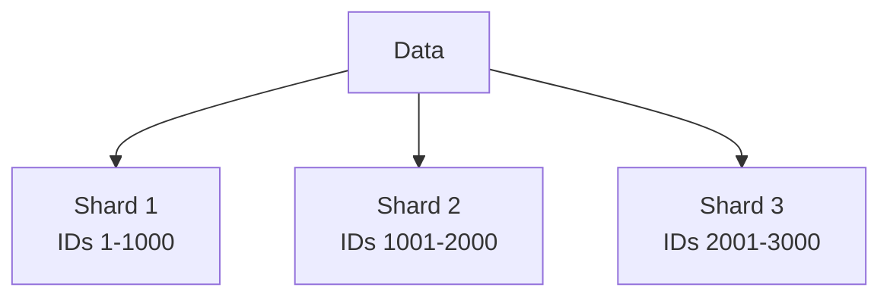
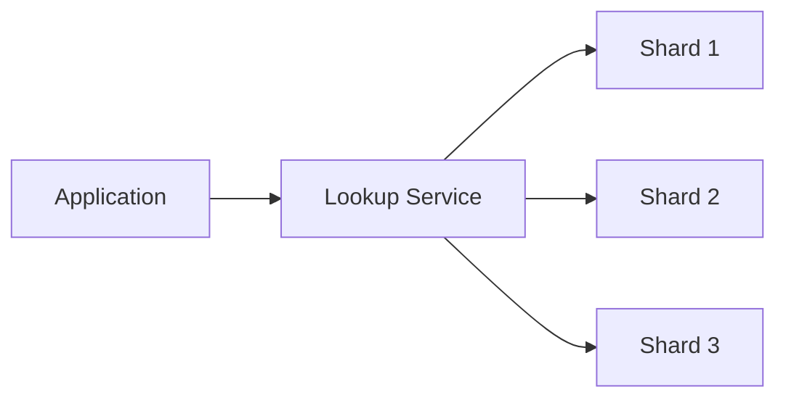

# Database Sharding

<div align="center">
  
</div>

## Table of Contents
- [Introduction to Sharding](#introduction-to-sharding)
- [Sharding Strategies](#sharding-strategies)
- [Partitioning Methods](#partitioning-methods)
- [Sharding Challenges](#sharding-challenges)
- [Implementation Examples](#implementation-examples)
- [Interview Tips](#interview-tips)

## Introduction to Sharding

Database sharding is a technique for breaking up a large database into smaller, more manageable pieces called shards. Each shard contains a subset of the data and is hosted on a separate database server instance.

### Benefits of Sharding
1. **Improved Performance**
2. **Better Scalability**
3. **Higher Availability**
4. **Reduced Query Load**

## Sharding Strategies

### 1. Range-Based Sharding


Example Implementation:
```sql
-- Shard 1: Customer IDs 1-1000
CREATE TABLE customers_1 (
    id INT PRIMARY KEY,
    name VARCHAR(255),
    CHECK (id BETWEEN 1 AND 1000)
);

-- Shard 2: Customer IDs 1001-2000
CREATE TABLE customers_2 (
    id INT PRIMARY KEY,
    name VARCHAR(255),
    CHECK (id BETWEEN 1001 AND 2000)
);
```

### 2. Hash-Based Sharding
```python
def get_shard(key, num_shards):
    """Determine shard based on hash of key."""
    return hash(key) % num_shards

class ShardedDatabase:
    def __init__(self, shard_count):
        self.shard_count = shard_count
        self.shards = [[] for _ in range(shard_count)]
    
    def insert(self, key, value):
        shard = get_shard(key, self.shard_count)
        self.shards[shard].append((key, value))
```

### 3. Directory-Based Sharding


## Partitioning Methods

### 1. Horizontal Partitioning (Sharding)
```sql
-- Shard 1
CREATE TABLE orders_2023 (
    order_id INT PRIMARY KEY,
    customer_id INT,
    order_date DATE,
    CHECK (order_date >= '2023-01-01' AND order_date < '2024-01-01')
);

-- Shard 2
CREATE TABLE orders_2024 (
    order_id INT PRIMARY KEY,
    customer_id INT,
    order_date DATE,
    CHECK (order_date >= '2024-01-01' AND order_date < '2025-01-01')
);
```

### 2. Vertical Partitioning
```sql
-- User basic info
CREATE TABLE user_profile (
    user_id INT PRIMARY KEY,
    username VARCHAR(50),
    email VARCHAR(100)
);

-- User detailed info
CREATE TABLE user_details (
    user_id INT PRIMARY KEY,
    address TEXT,
    preferences JSON,
    FOREIGN KEY (user_id) REFERENCES user_profile(user_id)
);
```

## Sharding Challenges

### 1. Joins Across Shards
```python
class CrossShardQuery:
    def join_user_orders(self, user_id):
        # Get user shard
        user_shard = self.get_user_shard(user_id)
        user = user_shard.get_user(user_id)
        
        # Get orders from all shards
        orders = []
        for shard in self.order_shards:
            shard_orders = shard.get_orders_for_user(user_id)
            orders.extend(shard_orders)
        
        return user, orders
```

### 2. Maintaining Consistency
```python
class ShardedTransaction:
    def transfer_money(self, from_account, to_account, amount):
        try:
            # Start distributed transaction
            self.start_transaction()
            
            # Get account shards
            from_shard = self.get_account_shard(from_account)
            to_shard = self.get_account_shard(to_account)
            
            # Perform transfer
            from_shard.deduct(from_account, amount)
            to_shard.add(to_account, amount)
            
            # Commit transaction
            self.commit()
        except Exception as e:
            self.rollback()
            raise e
```

### 3. Rebalancing Shards
```python
class ShardRebalancer:
    def rebalance(self, source_shard, target_shard):
        """Rebalance data between shards."""
        # Get data to move
        data_to_move = source_shard.get_data_for_rebalancing()
        
        # Move data in batches
        for batch in data_to_move:
            try:
                # Copy data to target
                target_shard.insert_batch(batch)
                # Verify data
                if self.verify_data(batch, target_shard):
                    # Delete from source
                    source_shard.delete_batch(batch)
            except Exception as e:
                self.handle_rebalancing_error(e, batch)
```

## Implementation Examples

### 1. MongoDB Sharding
```javascript
// Enable sharding for database
sh.enableSharding("mydb")

// Create a sharded collection
sh.shardCollection("mydb.users", {userId: "hashed"})

// Add shards
sh.addShard("rs1/shard1:27017")
sh.addShard("rs2/shard2:27017")
```

### 2. MySQL Sharding
```sql
-- Create shards
CREATE DATABASE shard1;
CREATE DATABASE shard2;

-- Create identical tables in each shard
USE shard1;
CREATE TABLE users (
    id INT PRIMARY KEY,
    name VARCHAR(255),
    email VARCHAR(255),
    shard_id INT
);

USE shard2;
CREATE TABLE users (
    id INT PRIMARY KEY,
    name VARCHAR(255),
    email VARCHAR(255),
    shard_id INT
);
```

## Interview Tips

### 1. Key Considerations
- Data distribution strategy
- Shard key selection
- Cross-shard queries
- Rebalancing approach
- Consistency requirements

### 2. Common Questions
1. How would you choose a shard key?
2. How do you handle joins across shards?
3. What are the trade-offs of different sharding strategies?
4. How would you implement resharding?

### 3. Best Practices
- Choose shard keys carefully
- Plan for data growth
- Consider maintenance operations
- Monitor shard balance
- Handle edge cases

## Real-World Examples

### 1. User Data Sharding
```python
class UserDatabase:
    def get_user_shard(self, user_id):
        """Get shard for user based on ID."""
        shard_id = user_id % self.num_shards
        return self.shards[shard_id]
    
    def create_user(self, user_data):
        """Create user in appropriate shard."""
        shard = self.get_user_shard(user_data['id'])
        return shard.insert_user(user_data)
```

### 2. Time-Series Data Sharding
```sql
-- Create time-based shards
CREATE TABLE metrics_2023_q1 (
    timestamp TIMESTAMP,
    metric_name VARCHAR(50),
    value DECIMAL,
    CHECK (timestamp >= '2023-01-01' AND timestamp < '2023-04-01')
);

CREATE TABLE metrics_2023_q2 (
    timestamp TIMESTAMP,
    metric_name VARCHAR(50),
    value DECIMAL,
    CHECK (timestamp >= '2023-04-01' AND timestamp < '2023-07-01')
);
```

## Further Reading
- [MongoDB Sharding](https://docs.mongodb.com/manual/sharding/)
- [MySQL Sharding Guide](https://dev.mysql.com/doc/refman/8.0/en/sharding.html)
- [Sharding Pattern](https://docs.microsoft.com/en-us/azure/architecture/patterns/sharding)
- [Database Internals Book](https://www.databass.dev) 