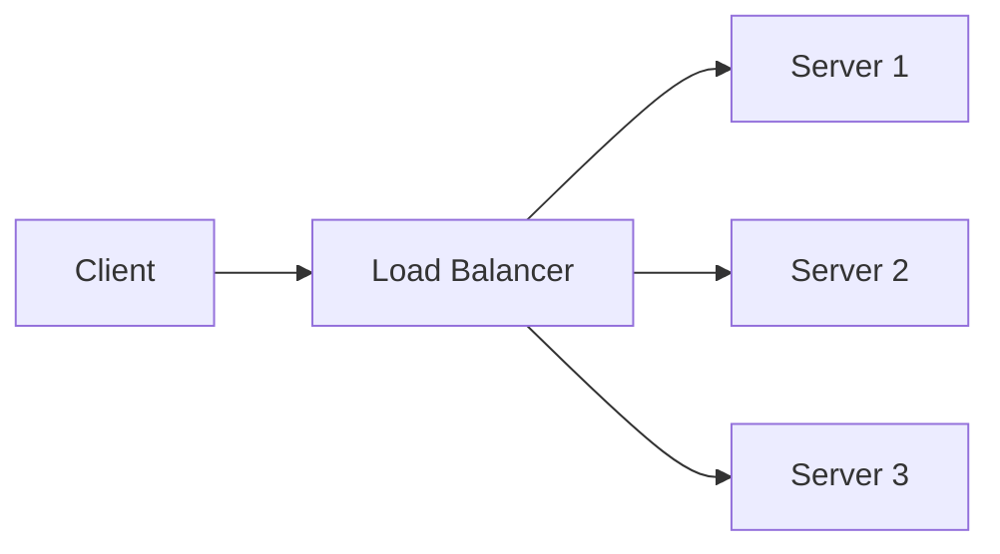

# Distributed Systems Fundamentals

<div align="center">
  
</div>

## Table of Contents
- [What is a Distributed System?](#what-is-a-distributed-system)
- [Key Characteristics](#key-characteristics)
- [Core Concepts](#core-concepts)
- [Common Challenges](#common-challenges)
- [Design Principles](#design-principles)
- [Interview Tips](#interview-tips)

## What is a Distributed System?

A distributed system is a collection of independent computers that appears to its users as a single coherent system. These systems work together by coordinating their actions through message passing to achieve a common goal.

### Key Properties
- **Concurrency**: Components execute simultaneously
- **Lack of global clock**: Components operate independently
- **Independent failures**: Parts can fail independently

## Key Characteristics

### 1. Scalability
- **Horizontal Scaling**: Adding more machines
- **Vertical Scaling**: Adding more power
- **Considerations**: 
  - Cost efficiency
  - Performance requirements
  - Maintenance overhead

### 2. Reliability
- **Fault Tolerance**: System continues despite failures
- **Redundancy**: Multiple copies of data/services
- **Strategies**:
  - Replication
  - Failover mechanisms
  - Health monitoring

### 3. Availability
- **High Availability**: System remains operational
- **SLA Guarantees**: Uptime commitments
- **Techniques**:
  - Load balancing
  - Geographic distribution
  - Automated recovery

### 4. Consistency
- **Data Consistency Models**:
  - Strong consistency
  - Eventual consistency
  - Causal consistency
- **CAP Theorem Trade-offs**

## Core Concepts

### 1. Communication Patterns


- **Synchronous vs Asynchronous**
- **Request-Response**
- **Publish-Subscribe**
- **Message Queues**

### 2. Data Management
- **Partitioning Strategies**
  - Range-based
  - Hash-based
  - Directory-based
- **Replication Patterns**
  - Master-slave
  - Multi-master
  - Quorum-based

### 3. Service Discovery
- **Service Registry**
- **Health Checking**
- **Load Balancing**

## Common Challenges

1. **Network Issues**
   - Latency
   - Partitions
   - Bandwidth limitations

2. **Data Consistency**
   - Concurrent updates
   - Conflict resolution
   - Data synchronization

3. **System Coordination**
   - Clock synchronization
   - Distributed transactions
   - Leader election

## Design Principles

### 1. Loose Coupling
- Independent scaling
- Failure isolation
- Easy maintenance

### 2. Single Responsibility
- Clear service boundaries
- Focused functionality
- Easier debugging

### 3. Idempotency
- Safe retry operations
- Consistent results
- Error handling

## Interview Tips

### 1. System Design Questions
- Start with requirements
- Consider scale
- Discuss trade-offs
- Address failure scenarios

### 2. Common Scenarios
- **Load Balancing**:
  ```mermaid
  graph TD
    A[Client] --> B[Load Balancer]
    B --> C[Server 1]
    B --> D[Server 2]
    C --> E[Database]
    D --> E
  ```
- **Data Partitioning**
- **Caching Strategies**
- **Message Queues**

### 3. Best Practices
- Begin with simple design
- Incrementally add complexity
- Justify design choices
- Consider operational aspects

## Real-World Examples

1. **E-commerce Platform**
   - Product catalog service
   - Order processing service
   - Payment service
   - Inventory management

2. **Social Media Application**
   - User service
   - Post service
   - Notification service
   - Analytics service

## Further Reading
- [Designing Data-Intensive Applications](https://dataintensive.net/)
- [Distributed Systems for Fun and Profit](http://book.mixu.net/distsys/)
- [CAP Theorem Explained](https://www.ibm.com/cloud/learn/cap-theorem)

## Practice Questions

1. How would you design a distributed cache?
2. Explain how you would implement a distributed counter
3. Design a distributed rate limiter
4. How would you handle network partitions in a distributed system?

Remember: In system design interviews, focus on:
- Scalability requirements
- Consistency needs
- Availability requirements
- Performance considerations
- Cost constraints 