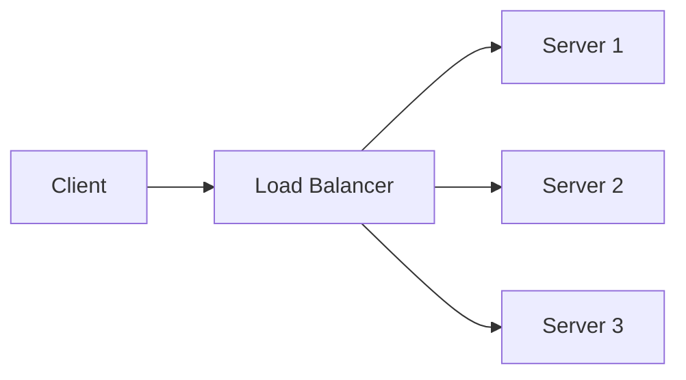

# Distributed Systems Fundamentals 📌

## Table of Contents

- [Prerequisites & Related Topics](#prerequisites--related-topics)
- [Pattern Recognition Guide](#pattern-recognition-guide)
- [What is a Distributed System?](#what-is-a-distributed-system)
- [Key Characteristics](#key-characteristics)
- [Core Concepts](#core-concepts)
- [Common Challenges](#common-challenges)
- [Design Principles](#design-principles)
- [Trade-offs](#trade-offs)
- [Edge Cases to Consider](#edge-cases-to-consider)
- [Common Pitfalls](#common-pitfalls)
- [FAQ](#faq)
- [Interview Tips](#interview-tips)
- [Real-World Examples](#real-world-examples)
- [Advanced Topics](#advanced-topics)
- [Further Reading](#further-reading)
- [Practice Questions](#practice-questions)

## Prerequisites & Related Topics

- Builds on: networking basics, single-node database internals
- Used in: [Replication](../scalability/replication.md), [Data Partitioning](../scalability/data-partitioning.md), [Cap Theorem](../scalability/cap-theorem.md)
- Techniques often combined: consensus, quorums, idempotency, backpressure
- See also: [Fallacies of Distributed Computing](https://en.wikipedia.org/wiki/Fallacies_of_distributed_computing) — the eight assumptions that bite every new system


## Pattern Recognition Guide

### 🎯 When to Use Distributed Systems Fundamentals 📌

**Keywords in requirements**: "multiple nodes", "replication", "consensus", "partial failure", "eventual consistency", "network partitions", "latency between services"
**Reach for this when**:
- Scale or availability beyond one machine
- Geo-distribution serving users from nearby regions
- Fault tolerance through redundancy
- Throughput via parallelism across nodes

### 🔑 Approach Indicators

| Approach | Signals | Best For |
|----------|---------|----------|
| Leader-follower replication | read scaling, failover | most databases |
| Quorum systems | tunable consistency | Dynamo-family |
| Consensus (Raft/Paxos) | strong coordination | etcd, CockroachDB, Spanner |
| Eventual + CRDT | offline tolerance, convergence | collaborative apps |
| Two-phase commit | atomic multi-node writes | rare — cost is availability |

### ❌ When NOT to Use

- One machine suffices — distribution multiplies failure modes for no return
- Strong global ordering needed at high write rates — partition or queue instead
- Team lacks operational maturity — a distributed monolith is the worst of both


## What is a Distributed System?

A distributed system is a collection of independent computers that appears to its users as a single coherent system. These systems work together by coordinating their actions through message passing to achieve a common goal.

### Key Properties
- **Concurrency**: Components execute simultaneously
- **Lack of global clock**: Components operate independently
- **Independent failures**: Parts can fail independently

## Key Characteristics

### 1. Scalability
- **Horizontal Scaling**: Adding more machines
- **Vertical Scaling**: Adding more power
- **Considerations**: 
  - Cost efficiency
  - Performance requirements
  - Maintenance overhead

### 2. Reliability
- **Fault Tolerance**: System continues despite failures
- **Redundancy**: Multiple copies of data/services
- **Strategies**:
  - Replication
  - Failover mechanisms
  - Health monitoring

### 3. Availability
- **High Availability**: System remains operational
- **SLA Guarantees**: Uptime commitments
- **Techniques**:
  - Load balancing
  - Geographic distribution
  - Automated recovery

### 4. Consistency
- **Data Consistency Models**:
  - Strong consistency
  - Eventual consistency
  - Causal consistency
- **CAP Theorem Trade-offs**

## Core Concepts

### 1. Communication Patterns


- **Synchronous vs Asynchronous**
- **Request-Response**
- **Publish-Subscribe**
- **Message Queues**

### 2. Data Management
- **Partitioning Strategies**
  - Range-based
  - Hash-based
  - Directory-based
- **Replication Patterns**
  - Master-slave
  - Multi-master
  - Quorum-based

### 3. Service Discovery
- **Service Registry**
- **Health Checking**
- **Load Balancing**

## Common Challenges

1. **Network Issues**
   - Latency
   - Partitions
   - Bandwidth limitations

2. **Data Consistency**
   - Concurrent updates
   - Conflict resolution
   - Data synchronization

3. **System Coordination**
   - Clock synchronization
   - Distributed transactions
   - Leader election

## Design Principles

### 1. Loose Coupling
- Independent scaling
- Failure isolation
- Easy maintenance

### 2. Single Responsibility
- Clear service boundaries
- Focused functionality
- Easier debugging

### 3. Idempotency
- Safe retry operations
- Consistent results
- Error handling

## Trade-offs

| Property | Strong Guarantee | Weaker Alternative | Cost of the Guarantee |
|----------|------------------|--------------------|-----------------------|
| Consistency | Strong (linearizability) | Eventual consistency | Higher latency, lower availability under partitions |
| Availability | Always responsive | Degrade during failures | Requires replication and failover machinery |
| Latency | Low, predictable | Variable | Limits replication distance and synchronous work |
| Fault tolerance | No data loss | Possible loss window | Durability costs (sync replication, WAL) |

**CAP in practice:** Under a network partition you must choose consistency or availability; systems decide per operation (quorum reads/writes tune where you land).

**Performance vs durability:** Synchronous replication protects every write but adds latency; asynchronous replication is fast but can lose recent writes on failure.

**Coordination vs autonomy:** Consensus and distributed locks give correctness but serialize work; coordination-free designs scale better but need conflict resolution.

> **⚠️ When NOT to use eventual consistency:** flows where a stale read causes real damage — payments, inventory commitments, permission checks. And never use it as an excuse to skip conflict-resolution design.

## Edge Cases to Consider

- Split-brain — two leaders after partition; leases/quorums arbitrate
- Gray failure — slow-not-dead nodes poison quorums and retries
- Retry storms — exponential backoff plus budgets, always
- Cross-region clock skew — hybrid logical clocks where ordering matters
- Poison messages and negative caching at every layer


## Common Pitfalls

1. Designing for the happy path — networks partition, nodes pause, disks fill
2. Assuming in-order, exactly-once delivery anywhere in the stack
3. Unbounded retries amplifying an outage
4. Confusing replication with backup
5. Testing only single-node failures in staging


## FAQ

**Q1: Why is exactly-once delivery so hard?**

A: Delivery and processing are separate events; a crash between them breaks the guarantee. The practical answer: at-least-once delivery plus idempotent processing.

**Q2: Consensus vs quorum reads?**

A: Quorum reads/writes are per-operation overlap guarantees; consensus is continuous agreement on a log. Systems use consensus for control planes and quorums for data paths.

**Q3: What is the first distributed-systems failure I should design for?**

A: The slow dependency: set timeouts and retries with backoff everywhere, then decide per-call what failure looks like (fallback, cached, shed).

## Interview Tips

### 1. System Design Questions
- Start with requirements
- Consider scale
- Discuss trade-offs
- Address failure scenarios

### 2. Common Scenarios
- **Load Balancing**:
  ```mermaid
  graph TD
    A[Client] --> B[Load Balancer]
    B --> C[Server 1]
    B --> D[Server 2]
    C --> E[Database]
    D --> E
  ```
- **Data Partitioning**
- **Caching Strategies**
- **Message Queues**

### 3. Best Practices
- Begin with simple design
- Incrementally add complexity
- Justify design choices
- Consider operational aspects

## Real-World Examples

1. **E-commerce Platform**
   - Product catalog service
   - Order processing service
   - Payment service
   - Inventory management

2. **Social Media Application**
   - User service
   - Post service
   - Notification service
   - Analytics service

## Advanced Topics

1. Raft and Multi-Paxos internals — elections, log replication, membership change
2. Hybrid logical clocks for causality tracking
3. Jepsen-style partition testing
4. Cell and shard architectures for blast-radius control


## Further Reading
- [Designing Data-Intensive Applications](https://dataintensive.net/)
- [Distributed Systems for Fun and Profit](http://book.mixu.net/distsys/)
- [CAP Theorem Explained](https://www.ibm.com/cloud/learn/cap-theorem)

## Practice Questions

1. How would you design a distributed cache?
2. Explain how you would implement a distributed counter
3. Design a distributed rate limiter
4. How would you handle network partitions in a distributed system?

Remember: In system design interviews, focus on:
- Scalability requirements
- Consistency needs
- Availability requirements
- Performance considerations
- Cost constraints 