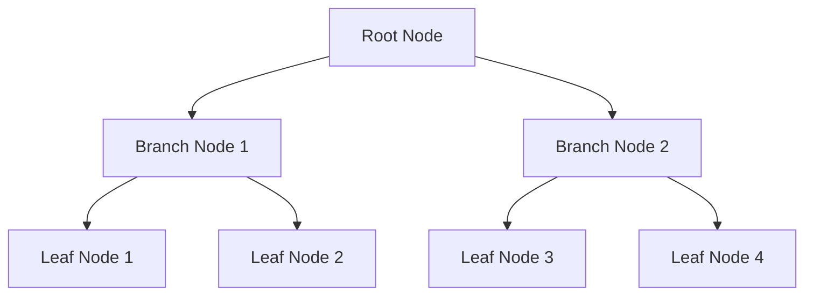

# Database Indexing

## Table of Contents
- [Introduction to Indexing](#introduction-to-indexing)
- [Types of Indexes](#types-of-indexes)
- [Index Data Structures](#index-data-structures)
- [Indexing Strategies](#indexing-strategies)
- [Performance Considerations](#performance-considerations)
- [Trade-offs](#trade-offs)
- [Interview Tips](#interview-tips)

## Introduction to Indexing

Database indexing is a data structure technique to improve the speed of data retrieval operations on a database table. It creates a separate structure that holds a reference to the data in a table, much like a book's index.

### Benefits of Indexing
1. **Faster Data Retrieval**
2. **Improved Query Performance**
3. **Unique Constraint Enforcement**
4. **Sorting Optimization**

## Types of Indexes

### 1. Single-Column Index
```sql
-- Create a basic index
CREATE INDEX idx_user_email 
ON users(email);

-- Query using the index
SELECT * FROM users 
WHERE email = 'user@example.com';
```

### 2. Composite Index
```sql
-- Create composite index
CREATE INDEX idx_user_name_email 
ON users(last_name, first_name);

-- Query using composite index
SELECT * FROM users 
WHERE last_name = 'Smith' 
AND first_name = 'John';
```

### 3. Unique Index
```sql
-- Create unique index
CREATE UNIQUE INDEX idx_user_email 
ON users(email);

-- This will enforce uniqueness
INSERT INTO users (email, name) 
VALUES ('user@example.com', 'John');
```

### 4. Partial Index
```sql
-- Create partial index
CREATE INDEX idx_active_users 
ON users(email) 
WHERE status = 'active';

-- Query using partial index
SELECT * FROM users 
WHERE status = 'active' 
AND email LIKE '%@company.com';
```

## Index Data Structures

### 1. B-Tree Index


### 2. Hash Index
```python
class HashIndex:
    def __init__(self):
        self.index = {}
    
    def add_entry(self, key, row_pointer):
        """Add index entry."""
        hash_key = hash(key)
        if hash_key not in self.index:
            self.index[hash_key] = []
        self.index[hash_key].append(row_pointer)
    
    def find_entry(self, key):
        """Find rows matching key."""
        hash_key = hash(key)
        return self.index.get(hash_key, [])
```

### 3. Bitmap Index
```python
class BitmapIndex:
    def __init__(self, values):
        self.values = values
        self.bitmaps = {}
    
    def build_index(self, column_data):
        """Build bitmap index for column."""
        for value in self.values:
            self.bitmaps[value] = [
                1 if item == value else 0 
                for item in column_data
            ]
    
    def query(self, value):
        """Get row positions for value."""
        return [
            i for i, bit in enumerate(self.bitmaps[value]) 
            if bit == 1
        ]
```

## Indexing Strategies

### 1. Covering Index
```sql
-- Create covering index
CREATE INDEX idx_user_email_name 
ON users(email) 
INCLUDE (first_name, last_name);

-- Query using covering index
SELECT first_name, last_name 
FROM users 
WHERE email = 'user@example.com';
```

### 2. Index with Include
```sql
-- Create index with included columns
CREATE INDEX idx_orders_date 
ON orders(order_date) 
INCLUDE (total_amount, status);

-- Query using included columns
SELECT order_date, total_amount, status 
FROM orders 
WHERE order_date >= '2023-01-01';
```

### 3. Filtered Index
```sql
-- Create filtered index
CREATE INDEX idx_premium_users 
ON users(email) 
WHERE account_type = 'premium';

-- Query using filtered index
SELECT * FROM users 
WHERE account_type = 'premium' 
AND email LIKE '%@company.com';
```

## Performance Considerations

### 1. Index Selection
```sql
-- Analyze query performance
EXPLAIN ANALYZE 
SELECT * FROM users 
WHERE email = 'user@example.com';

-- Check index usage
SELECT 
    schemaname, 
    tablename, 
    indexname, 
    idx_scan, 
    idx_tup_read
FROM pg_stat_user_indexes;
```

### 2. Index Maintenance
```sql
-- Rebuild index
ALTER INDEX idx_user_email REBUILD;

-- Update statistics
ANALYZE users;

-- Monitor index size
SELECT 
    pg_size_pretty(pg_relation_size('idx_user_email')) 
    as index_size;
```

### 3. Query Optimization
```sql
-- Use index hints when needed
SELECT /*+ INDEX(users idx_user_email) */ 
    * FROM users 
WHERE email = 'user@example.com';

-- Force index usage
SELECT * FROM users 
FORCE INDEX (idx_user_email)
WHERE email = 'user@example.com';
```

## Trade-offs

| Index Type | Pros | Cons | Best For |
|------------|------|------|----------|
| B-Tree | Balanced reads/writes, range and equality queries, ordered scans | Extra write cost, page splits under heavy insert | General-purpose OLTP queries |
| Hash | O(1) equality lookups | No range scans, no ordering | Key-value style equality only |
| Bitmap | Very fast on low-cardinality columns | Expensive updates, poor for high-cardinality | Analytics on few distinct values |
| Composite | Serves multi-column filters | Only leading columns used; wider rows | Known multi-column query patterns |

**Read speed vs write cost:** Every index speeds reads but slows writes and consumes storage — index selection is a bet on query patterns.

**Coverage vs maintenance:** Covering indexes avoid table lookups entirely but are expensive to maintain as data changes.

**Many indexes vs few:** More indexes cover more queries but multiply write amplification; measure query patterns before adding.

> **⚠️ When NOT to add an index:** low-selectivity columns (few distinct values), tiny tables where full scans are faster, and write-heavy tables already paying too much index maintenance — every index is a tax on writes.

## Interview Tips

### 1. Key Considerations
- Index selectivity
- Write performance impact
- Storage requirements
- Maintenance overhead
- Query patterns

### 2. Common Questions
1. When should you not use an index?
2. How do you choose columns for indexing?
3. What are the trade-offs of different index types?
4. How do you optimize index usage?

### 3. Best Practices
- Index high-selectivity columns
- Consider query patterns
- Monitor index usage
- Regular maintenance
- Balance with write performance

## Real-World Examples

### 1. User Search System
```sql
-- Create indexes for user search
CREATE INDEX idx_user_search 
ON users(
    last_name, 
    first_name, 
    email
);

-- Create trigram index for fuzzy search
CREATE INDEX idx_user_name_trigram 
ON users 
USING gin(first_name gin_trgm_ops, last_name gin_trgm_ops);

-- Example search query
SELECT * FROM users 
WHERE 
    last_name ILIKE '%smith%' 
    OR first_name ILIKE '%john%';
```

### 2. Time-Series Data
```sql
-- Create time-based index
CREATE INDEX idx_metrics_time 
ON metrics(
    timestamp DESC
) 
INCLUDE (value, metric_type);

-- Example range query
SELECT 
    date_trunc('hour', timestamp) as hour,
    avg(value) as avg_value
FROM metrics 
WHERE 
    timestamp >= NOW() - INTERVAL '24 hours'
    AND metric_type = 'cpu_usage'
GROUP BY hour
ORDER BY hour DESC;
```

## Further Reading
- [PostgreSQL Indexing](https://www.postgresql.org/docs/current/indexes.html)
- [MySQL Indexing Best Practices](https://dev.mysql.com/doc/refman/8.0/en/optimization-indexes.html)
- [Database Indexing Explained](https://use-the-index-luke.com/)
- [MongoDB Indexing Strategies](https://docs.mongodb.com/manual/indexes/) 