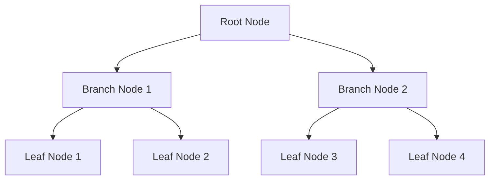

# Database Indexing in System Design 📌

## Table of Contents

- [Introduction to Indexing](#introduction-to-indexing)
- [Prerequisites & Related Topics](#prerequisites--related-topics)
- [Pattern Recognition Guide](#pattern-recognition-guide)
- [Types of Indexes](#types-of-indexes)
- [Index Data Structures](#index-data-structures)
- [Indexing Strategies](#indexing-strategies)
- [Performance Considerations](#performance-considerations)
- [Trade-offs](#trade-offs)
- [Edge Cases to Consider](#edge-cases-to-consider)
- [Common Pitfalls](#common-pitfalls)
- [FAQ](#faq)
- [Interview Tips](#interview-tips)
- [Real-World Examples](#real-world-examples)
- [Advanced Topics](#advanced-topics)
- [Further Reading](#further-reading)

## Introduction to Indexing

Database indexing is a data structure technique to improve the speed of data retrieval operations on a database table. It creates a separate structure that holds a reference to the data in a table, much like a book's index.

### Benefits of Indexing
1. **Faster Data Retrieval**
2. **Improved Query Performance**
3. **Unique Constraint Enforcement**
4. **Sorting Optimization**

## Prerequisites & Related Topics

- **Builds on**: B-tree/LSM data structures, query execution basics
- **Used in**: [Caching](caching.md) (different layer, same goal), [Database Sharding](database-sharding.md) (per-shard indexes), [Performance Optimization](../best-practices/performance.md)
- **Techniques often combined**: covering indexes, composite column ordering, partial indexes
- **See also**: [Data Modeling](../data-engineering/data-modeling.md) — access patterns decide both schema and indexes

## Pattern Recognition Guide

### 🎯 When to Use Database Indexing

**Keywords in requirements**: "slow query", "full table scan", "lookup by", "sort by", "range filter", "query optimization"
**Reach for this when**:
- Point lookups by a known column (email, external ID)
- Ordered range scans (created_at windows)
- Join and foreign-key columns
- Covering a hot query entirely (index-only scan)

### 🔑 Approach Indicators

| Approach | Signals | Best For |
|----------|---------|----------|
| B-Tree | equality + ranges, ordered scans | default OLTP choice |
| Hash | equality only | key-value lookups |
| LSM-Tree | write-heavy, compaction | write-mostly stores |
| Full-text/GIN | containment, search | text and JSONB |
| Composite | multi-column filters | leading-column rule |

### ❌ When NOT to Use

- Tiny tables — a scan is cheaper than the index maintenance
- Write-heavy tables with rare reads — every index taxes every write
- Low-selectivity columns alone (boolean flags) — rarely worth it

## Types of Indexes

### 1. Single-Column Index
**Index:** `idx_user_email` on `users(email)` — a single-column lookup index; keep the indexed set small and hot.

### 2. Composite Index
**Index:** `idx_user_name_email` on `users(last_name,first_name)` — in composite indexes the leading column must match equality filters, trailing columns serve range scans.

### 3. Unique Index
**Index:** `idx_user_email` on `users(email)` — a single-column lookup index; keep the indexed set small and hot.

### 4. Partial Index
**Index:** `idx_active_users` on `users(email)` — a single-column lookup index; keep the indexed set small and hot.

## Index Data Structures

### 1. B-Tree Index

### 2. Hash Index
**How it works — Hash index:** Build the auxiliary structure that turns the dominant lookup from a full scan into a seek; the trade is extra storage and write amplification, so index the filters you actually use.

### 3. Bitmap Index
**How it works — Bitmap index:** Build the auxiliary structure that turns the dominant lookup from a full scan into a seek; the trade is extra storage and write amplification, so index the filters you actually use.

## Indexing Strategies

### 1. Covering Index
**Index:** `idx_user_email_name` on `users(email)` — a single-column lookup index; keep the indexed set small and hot.

### 2. Index with Include
**Index:** `idx_orders_date` on `orders(order_date)` — a single-column lookup index; keep the indexed set small and hot.

### 3. Filtered Index
**Index:** `idx_premium_users` on `users(email)` — a single-column lookup index; keep the indexed set small and hot.

## Performance Considerations

### 1. Index Selection
**How to read it:** run the query through the planner and confirm it seeks the index rather than scanning the table — a full scan on a hot path is the usual smell.

### 2. Index Maintenance
Indexes aren't free at write time — every insert/update touches each index on the table, so B-trees fragment and waste pages as keys are deleted and re-added. Periodic rebuilds (or online rebuilds on live systems) compact the tree and refresh statistics; the interview soundbite: index count is a write-amplification dial, not a free lunch.

### 3. Query Optimization
Trust the planner, but verify: a query can ignore a perfectly good index if the predicate wraps the column in a function, the filter matches too much of the table (low selectivity), or statistics are stale. Fix the query shape or refresh stats before reaching for planner hints — hints are a last resort that freezes the plan against future data changes.

## Trade-offs

| Index Type | Pros | Cons | Best For |
|------------|------|------|----------|
| B-Tree | Balanced reads/writes, range and equality queries, ordered scans | Extra write cost, page splits under heavy insert | General-purpose OLTP queries |
| Hash | O(1) equality lookups | No range scans, no ordering | Key-value style equality only |
| Bitmap | Very fast on low-cardinality columns | Expensive updates, poor for high-cardinality | Analytics on few distinct values |
| Composite | Serves multi-column filters | Only leading columns used; wider rows | Known multi-column query patterns |

**Read speed vs write cost:** Every index speeds reads but slows writes and consumes storage — index selection is a bet on query patterns.

**Coverage vs maintenance:** Covering indexes avoid table lookups entirely but are expensive to maintain as data changes.

**Many indexes vs few:** More indexes cover more queries but multiply write amplification; measure query patterns before adding.

> **⚠️ When NOT to add an index:** low-selectivity columns (few distinct values), tiny tables where full scans are faster, and write-heavy tables already paying too much index maintenance — every index is a tax on writes.

## Edge Cases to Consider

- Function-wrapped columns (`WHERE lower(email)=…`) bypass the index — index the expression
- Implicit type casts defeating the predicate
- NULL handling differing by engine
- Stale statistics making the planner ignore a good index
- Right-most index page contention on monotonically increasing keys

## Common Pitfalls

1. Indexing every column — writes collapse under the tax
2. SELECT * defeating covering indexes and dragging wide rows
3. Wrong composite order — equality columns lead, range columns trail
4. Adding an index without checking the plan actually uses it
5. Long-running transactions blocking index rebuilds

## FAQ

**Q1: Composite index: which column first?**

A: Equality predicates first (leftmost rule), then the range/sort column — `orders(status, created_at)` serves "open orders in window" perfectly.

**Q2: Why is my index ignored?**

A: Low selectivity, function-wrapped columns, implicit casts, stale stats, or the planner correctly preferring a scan — read the EXPLAIN plan, not the index list.

**Q3: Index or cache?**

A: Index makes *every* query cheaper at O(log n); cache makes *hot* queries O(1) with staleness. Index first — it is correctness-preserving.

## Interview Tips

### 1. Key Considerations
- Index selectivity
- Write performance impact
- Storage requirements
- Maintenance overhead
- Query patterns

### 2. Common Questions
1. When should you not use an index?
2. How do you choose columns for indexing?
3. What are the trade-offs of different index types?
4. How do you optimize index usage?

### 3. Best Practices
- Index high-selectivity columns
- Consider query patterns
- Monitor index usage
- Regular maintenance
- Balance with write performance

## Real-World Examples

### 1. User Search System
**Index:** `idx_user_search` on `users(last_name,first_name,email)` — in composite indexes the leading column must match equality filters, trailing columns serve range scans.

### 2. Time-Series Data
**Index:** `idx_metrics_time` on `metrics(timestampDESC)` — a single-column lookup index; keep the indexed set small and hot.

## Advanced Topics

1. **Partial/filtered indexes** — index only the hot subset (unshipped orders)
2. **BRIN** for append-only time-series
3. **Index-only scans & INCLUDE columns**
4. **Online rebuilds** and statistics maintenance strategies

## Further Reading
- [PostgreSQL Indexing](https://www.postgresql.org/docs/current/indexes.html)
- [MySQL Indexing Best Practices](https://dev.mysql.com/doc/refman/8.0/en/optimization-indexes.html)
- [Database Indexing Explained](https://use-the-index-luke.com/)
- [MongoDB Indexing Strategies](https://docs.mongodb.com/manual/indexes/) 
