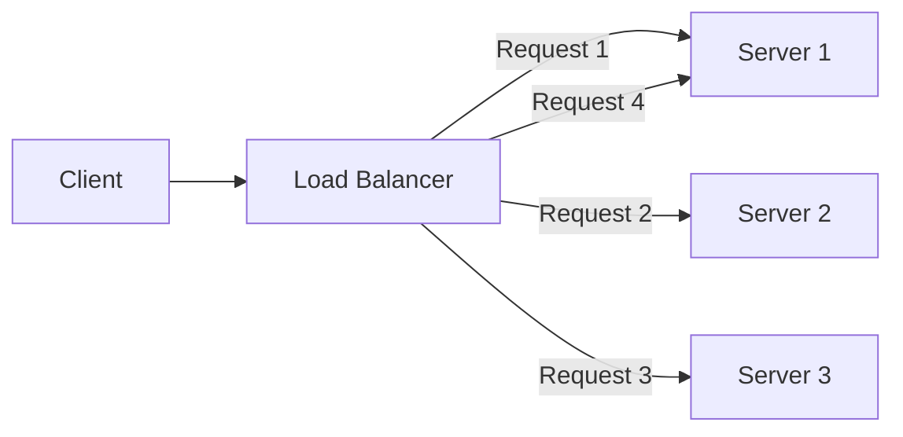
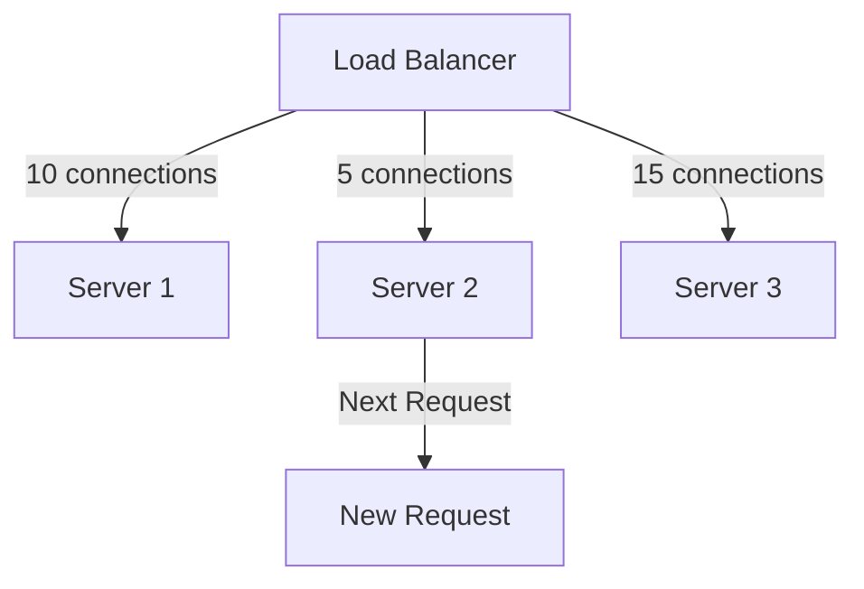
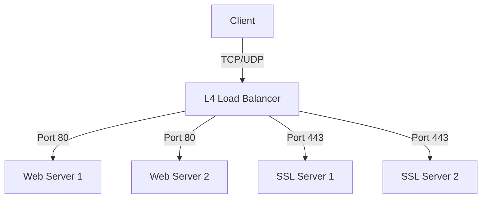
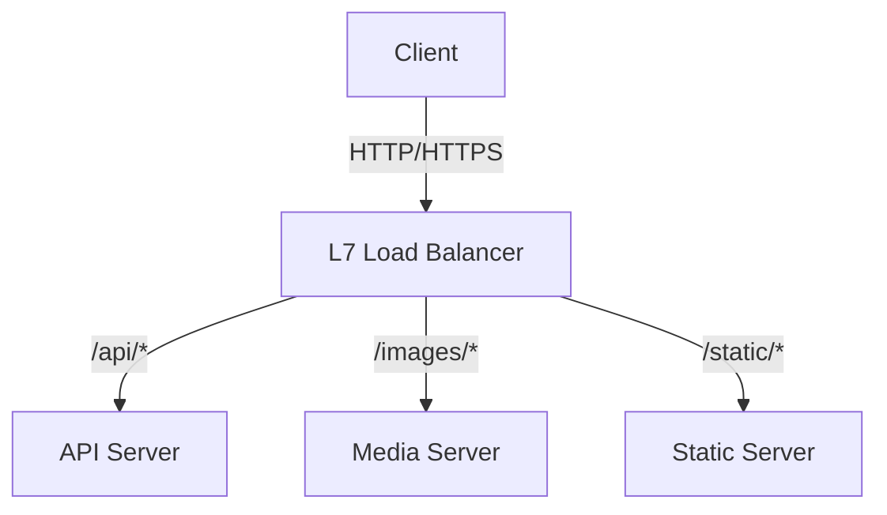
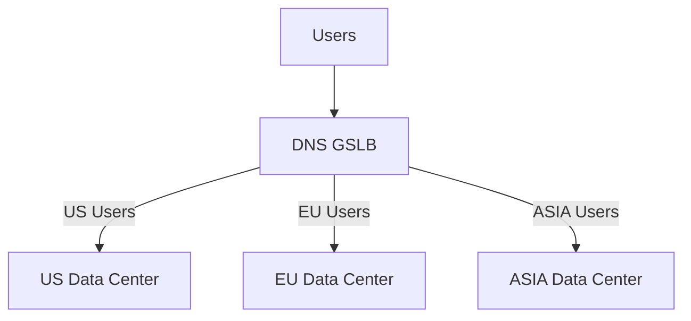
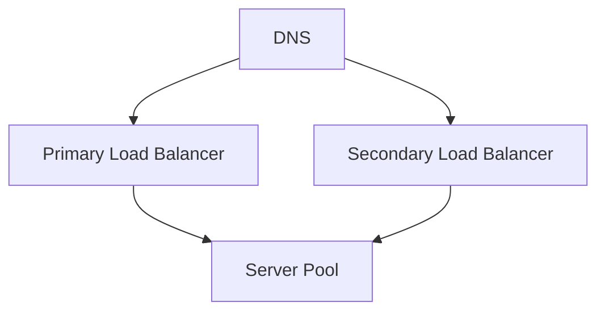

# Load Balancing in System Design 📌

## Table of Contents

- [Introduction to Load Balancing](#introduction-to-load-balancing)
- [Prerequisites & Related Topics](#prerequisites--related-topics)
- [Pattern Recognition Guide](#pattern-recognition-guide)
- [Load Balancing Algorithms](#load-balancing-algorithms)
- [Types of Load Balancers](#types-of-load-balancers)
- [Health Checking](#health-checking)
- [Session Persistence](#session-persistence)
- [Common Configurations](#common-configurations)
- [Trade-offs](#trade-offs)
- [Edge Cases to Consider](#edge-cases-to-consider)
- [Common Pitfalls](#common-pitfalls)
- [FAQ](#faq)
- [Interview Tips](#interview-tips)
- [Real-World Examples](#real-world-examples)
- [Advanced Topics](#advanced-topics)
- [Further Reading](#further-reading)

## Introduction to Load Balancing

Load balancing is the process of distributing network traffic across multiple servers to ensure high availability and reliability by sending requests to the server best suited to handle them.

### Benefits
1. **High Availability**
2. **Scalability**
3. **Redundancy**
4. **Flexibility**
5. **Efficiency**

## Prerequisites & Related Topics

- **Builds on**: DNS fundamentals, TCP/HTTP basics
- **Used in**: CDN & Content Delivery, [API Design](api-design.md), [Microservices](../scalability/microservices.md), [Rate Limiting](../architecture/rate-limiting.md)
- **Techniques often combined**: Health checks, session persistence, TLS termination, autoscaling
- **See also**: Proxies (the entry point often *is* a reverse proxy)

## Pattern Recognition Guide

### 🎯 When to Use Load Balancing

**Keywords in requirements**: "distribute traffic", "horizontal scaling", "high availability", "traffic spikes", "single point of failure", "zero-downtime deploy"
**Reach for this when**:
- Multiple servers must share traffic safely
- Rolling deployments without downtime (drain + health checks)
- Regional or zonal failover for availability
- TLS termination and edge policy enforcement in one place

### 🔑 Approach Indicators

| Approach | Signals | Best For |
|----------|---------|----------|
| Round Robin | homogeneous servers, similar request cost | simple web fleet |
| Weighted Round Robin | uneven server capacity | mixed instance sizes |
| Least Connections | request costs vary widely | API servers |
| IP Hash / Cookie | session affinity required | legacy stateful apps |
| L7 path routing | route by URL or host | microservices gateway |

### ❌ When NOT to Use

- One server genuinely suffices → an LB is one more moving part, not a feature
- East-west service-to-service calls → a service mesh may fit better
- Users are globally distributed → combine with CDN and DNS-based geo routing

## Load Balancing Algorithms

### 1. Round Robin

### 2. Weighted Round Robin
Each backend carries a weight proportional to its capacity; the balancer walks the pool and grants each server a share of traffic matching its weight, so a 3:2:1 weight split sends exactly 50%/33%/17% of requests to the three servers. Use it when server sizes differ — the knobs are the per-server weights, adjusted as capacity changes.

### 3. Least Connections

### 4. IP Hash
**How it works — Ip hash:** the client's source IP is hashed into the pool, pinning each user to one backend with zero session state — simple stickiness that breaks when clients hide behind large NATs and when the pool resizes.

## Types of Load Balancers

### 1. Layer 4 Load Balancing

### 2. Layer 7 Load Balancing

### 3. Global Server Load Balancing (GSLB)

## Health Checking

### 1. Active Health Checks
**How it works — active checks:** the balancer probes each backend on a fixed interval with a synthetic HTTP/TCP request and pulls any server that fails the check, returning it once probes pass again. Knobs: probe interval (detection speed vs. backend load), healthy/unhealthy thresholds (avoid flapping), and the probe path (a lightweight `/health` endpoint that doesn't hit the database).

### 2. Passive Health Checks
**How it works — passive checks:** no probing — the balancer watches real traffic and ejects a server after repeated failures, connection refusals, or timeouts on actual requests. Cheaper than active checks and instant on user-visible errors, but a server with zero traffic never gets tested; most production balancers combine both.

## Session Persistence

### 1. Cookie-Based Persistence
**How it works — cookie stickiness:** on the first response the balancer injects a cookie naming the chosen backend; every later request carrying that cookie routes to the same server. No server-side state required — the client remembers the mapping — at the cost of one extra header and broken stickiness when users clear cookies or share sessions across devices.

### 2. IP-Based Persistence
**How it works — IP hash:** hash the client's source IP into the server pool, so the same user always lands on the same backend. Zero added latency and no cookie, but two caveats to call out: clients behind large NAT/proxies (mobile carriers, offices) collapse into one hash bucket, and changing the pool size reshuffles most mappings.

## Common Configurations

### 1. High Availability Setup

### 2. SSL Termination
**How it works — SSL termination:** the load balancer owns the TLS certificate and decrypts incoming HTTPS, forwarding plain HTTP to backends inside the trusted network. Backends are freed from the CPU cost of handshakes and certificate rotation happens in one place; the price is unencrypted hops behind the balancer — fine inside a private VPC, not across an untrusted network.

### 3. Rate Limiting
**How it works — balancer-side rate limiting:** the balancer tracks requests per client (token bucket or leaky bucket keyed by IP or API key) and sheds excess traffic with a 429 before it ever reaches the backends. Enforcing here protects every downstream server at once — the caveat is state: with multiple balancer instances, per-client counters must be shared or the real limit multiplies.

## Trade-offs

| Algorithm | Pros | Cons | Best For |
|-----------|------|------|----------|
| Round Robin | Simple, fair distribution | Ignores server load and request cost | Homogeneous servers, similar requests |
| Least Connections | Adapts to long-lived requests | Needs connection tracking | Variable request durations |
| Weighted | Matches heterogeneous capacity | Weights need maintenance | Mixed server sizes |
| IP Hash | Session affinity without a store | Uneven distribution, breaks when servers change | Sticky sessions (simple needs) |
| Least Response Time | Adapts to actual performance | More measurement overhead | Latency-sensitive services |

**L4 vs L7:** Layer 4 balancing is faster and simpler but cannot route on content; Layer 7 enables path-based routing, TLS termination, and smarter policies at higher CPU cost.

**Statelessness vs affinity:** Sticky sessions simplify stateful apps but hurt availability and balance; keeping servers stateless lets any node serve any request.

**Health checking sensitivity:** Aggressive checks remove flaky servers quickly but can thrash the pool; passive checks add no probing load but react slowly.

> **⚠️ When NOT to use round robin:** heterogeneous server capacities (use weighted), long-lived uneven requests (least connections), and stateful apps that need session affinity without external session storage.

## Edge Cases to Consider

- All backends unhealthy — serve a maintenance page instead of erroring everything
- Backend flapping — thresholds too tight cause membership churn
- Session loss on backend restart — stickiness without shared session storage breaks users
- No drain window — deploys kill in-flight requests
- Clients behind large NATs — IP-hash stickiness collapses them onto one backend

## Common Pitfalls

1. Skipping health checks — dead servers keep receiving traffic
2. Using sticky sessions to paper over stateful design instead of going stateless
3. LB retry + client retry = retry storms; configure budgets
4. No connection draining during deploys
5. TLS termination everywhere while sending plaintext over untrusted links

## FAQ

**Q1: L4 or L7 balancer?**

A: L4 is faster and protocol-agnostic; L7 understands HTTP so it can route by path, cache, and rewrite headers. Public web/API traffic almost always wants L7.

**Q2: Do sticky sessions mean I can keep server-side state?**

A: Avoid it. Stickiness breaks on backend failure and rebalancing; externalize state to Redis or the database and stay stateless.

**Q3: Where do rate limiting and load balancing meet?**

A: The balancer (or gateway in front of it) is the natural enforcement point — shed excess traffic before it consumes backend capacity.

## Interview Tips

### 1. Design Considerations
- Scalability requirements
- High availability needs
- Geographic distribution
- Session handling
- SSL/TLS requirements

### 2. Common Questions
1. How would you design a global load balancing solution?
2. What load balancing algorithm would you choose for a specific use case?
3. How do you handle session persistence in a distributed system?
4. Design a load balancer for a microservices architecture

### 3. Best Practices
- Always implement health checks
- Use appropriate algorithms
- Plan for failure
- Monitor performance
- Consider security

## Real-World Examples

### 1. Web Application Load Balancing
**How it works — web tier balancing:** a least-connections spread across stateless app servers, since web requests vary widely in cost — a heavy report query holds a connection far longer than a static asset. Stateless design means any server can serve any request, so persistence is unnecessary and a failing server just drains via health checks.

### 2. API Gateway Load Balancing
**How it works — gateway balancing:** the API gateway itself becomes L7 balancer — routing by path (`/orders` → orders service), applying auth and rate limits first, then load-balancing within each service pool. This is where per-service pools beat one big pool: a slow orders service can only exhaust its own capacity budget, not the gateway's.

## Advanced Topics

1. **Adaptive balancing** — least-request with outlier ejection (Envoy-style)
2. **Consistent-hash balancing** — cache-friendly backend affinity
3. **Anycast + global LB** — same IP announced from many regions
4. **eBPF/XDP load balancing** — kernel-level forwarding (e.g., Katran)

## Further Reading
- [NGINX Load Balancing Guide](https://www.nginx.com/resources/glossary/load-balancing/)
- [HAProxy Documentation](http://www.haproxy.org/#docs)
- [AWS ELB Best Practices](https://aws.amazon.com/elasticloadbalancing/features/)
- [Google Cloud Load Balancing](https://cloud.google.com/load-balancing/docs/concepts) 
