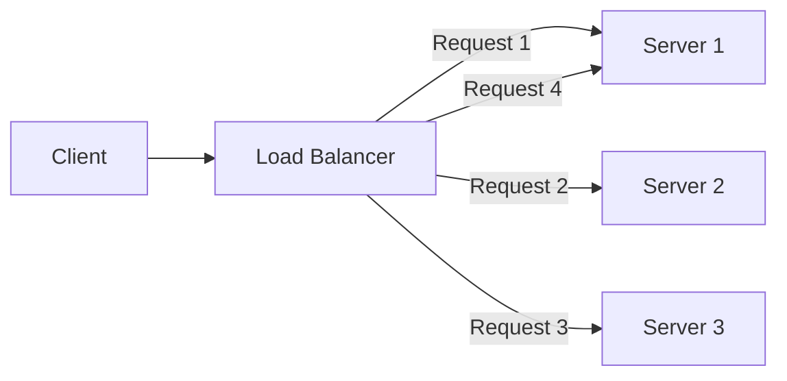
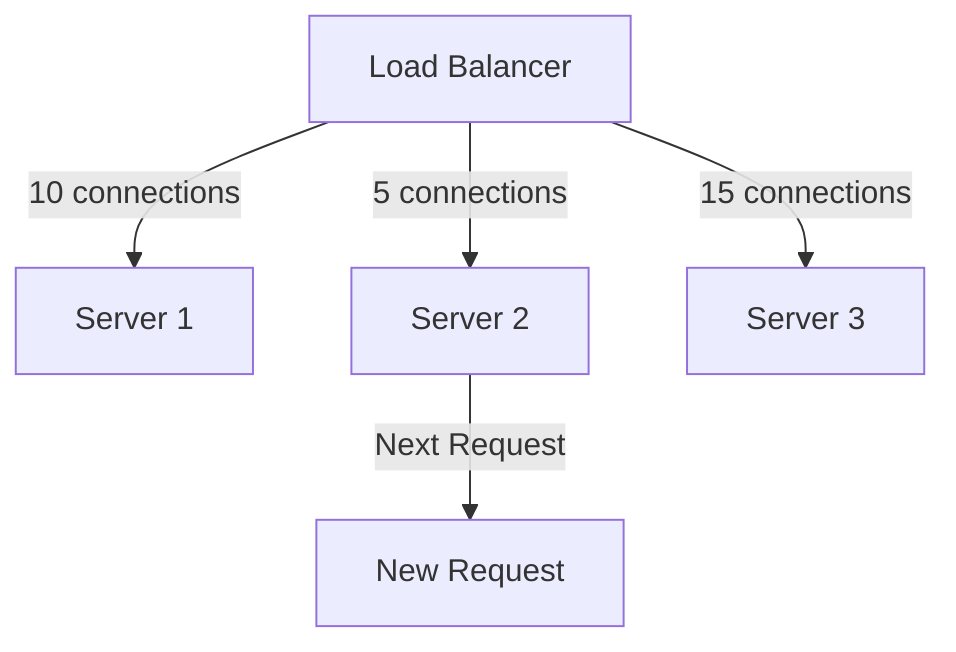
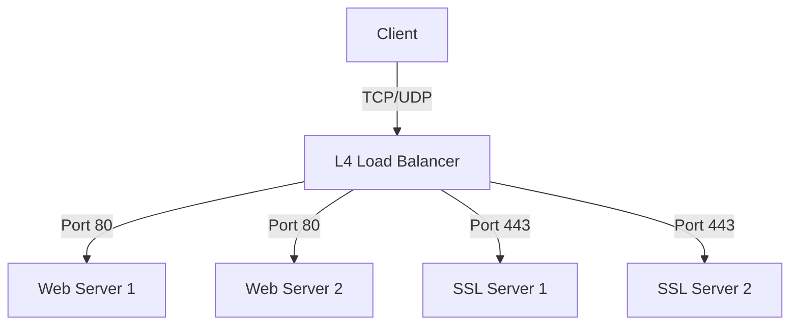
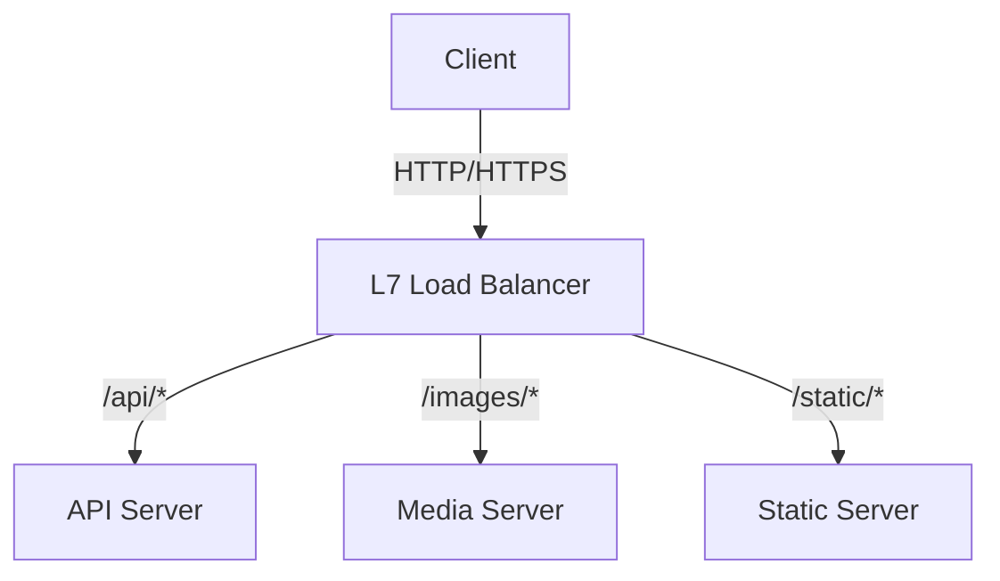
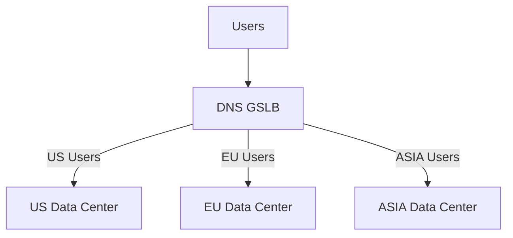
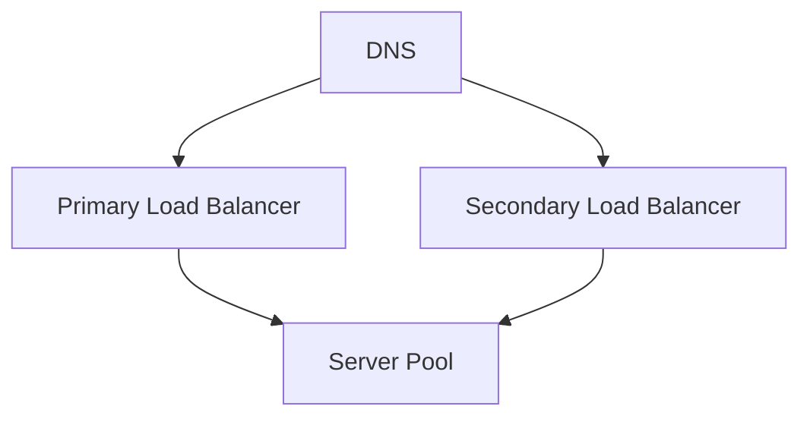

# Load Balancing Fundamentals

## Table of Contents
- [Introduction to Load Balancing](#introduction-to-load-balancing)
- [Load Balancing Algorithms](#load-balancing-algorithms)
- [Types of Load Balancers](#types-of-load-balancers)
- [Health Checking](#health-checking)
- [Session Persistence](#session-persistence)
- [Common Configurations](#common-configurations)
- [Trade-offs](#trade-offs)
- [Interview Tips](#interview-tips)

## Introduction to Load Balancing

Load balancing is the process of distributing network traffic across multiple servers to ensure high availability and reliability by sending requests to the server best suited to handle them.

### Benefits
1. **High Availability**
2. **Scalability**
3. **Redundancy**
4. **Flexibility**
5. **Efficiency**

## Load Balancing Algorithms

### 1. Round Robin


### 2. Weighted Round Robin
```python
class WeightedRoundRobin:
    def __init__(self, servers):
        self.servers = [(server, weight) for server, weight in servers]
        self.current = 0
        self.current_weight = 0
        
    def get_next_server(self):
        total_weight = sum(weight for _, weight in self.servers)
        while True:
            self.current = (self.current + 1) % len(self.servers)
            if self.current == 0:
                self.current_weight -= 1
                if self.current_weight <= 0:
                    self.current_weight = total_weight
            if self.servers[self.current][1] >= self.current_weight:
                return self.servers[self.current][0]
```

### 3. Least Connections


### 4. IP Hash
```python
def ip_hash(ip_address, server_count):
    """Simple IP hash load balancing."""
    hash_value = sum(int(octet) for octet in ip_address.split('.'))
    return hash_value % server_count
```

## Types of Load Balancers

### 1. Layer 4 Load Balancing


### 2. Layer 7 Load Balancing


### 3. Global Server Load Balancing (GSLB)


## Health Checking

### 1. Active Health Checks
```nginx
# Nginx Health Check Configuration
upstream backend {
    server backend1.example.com:8080 max_fails=3 fail_timeout=30s;
    server backend2.example.com:8080 max_fails=3 fail_timeout=30s;
    check interval=3000 rise=2 fall=5 timeout=1000 type=http;
    check_http_send "HEAD / HTTP/1.0\r\n\r\n";
    check_http_expect_alive http_2xx http_3xx;
}
```

### 2. Passive Health Checks
```yaml
# HAProxy Configuration
backend web-backend
    mode http
    balance roundrobin
    option redispatch
    server web1 web1.example.com:80 check inter 2000 rise 2 fall 3
    server web2 web2.example.com:80 check inter 2000 rise 2 fall 3
```

## Session Persistence

### 1. Cookie-Based Persistence
```nginx
# Nginx Cookie-Based Session Persistence
upstream backend {
    ip_hash;
    server backend1.example.com:8080;
    server backend2.example.com:8080;
    sticky cookie srv_id expires=1h domain=.example.com path=/;
}
```

### 2. IP-Based Persistence
```python
class IPHashLoadBalancer:
    def __init__(self, servers):
        self.servers = servers
        
    def get_server(self, client_ip):
        """Get consistent server based on client IP."""
        hash_value = hash(client_ip)
        return self.servers[hash_value % len(self.servers)]
```

## Common Configurations

### 1. High Availability Setup


### 2. SSL Termination
```nginx
# Nginx SSL Termination
server {
    listen 443 ssl;
    server_name example.com;
    
    ssl_certificate /path/to/cert.pem;
    ssl_certificate_key /path/to/key.pem;
    
    location / {
        proxy_pass http://backend;
        proxy_set_header X-Real-IP $remote_addr;
    }
}
```

### 3. Rate Limiting
```nginx
# Nginx Rate Limiting
http {
    limit_req_zone $binary_remote_addr zone=one:10m rate=1r/s;
    
    server {
        location /api/ {
            limit_req zone=one burst=5;
            proxy_pass http://backend;
        }
    }
}
```

## Trade-offs

| Algorithm | Pros | Cons | Best For |
|-----------|------|------|----------|
| Round Robin | Simple, fair distribution | Ignores server load and request cost | Homogeneous servers, similar requests |
| Least Connections | Adapts to long-lived requests | Needs connection tracking | Variable request durations |
| Weighted | Matches heterogeneous capacity | Weights need maintenance | Mixed server sizes |
| IP Hash | Session affinity without a store | Uneven distribution, breaks when servers change | Sticky sessions (simple needs) |
| Least Response Time | Adapts to actual performance | More measurement overhead | Latency-sensitive services |

**L4 vs L7:** Layer 4 balancing is faster and simpler but cannot route on content; Layer 7 enables path-based routing, TLS termination, and smarter policies at higher CPU cost.

**Statelessness vs affinity:** Sticky sessions simplify stateful apps but hurt availability and balance; keeping servers stateless lets any node serve any request.

**Health checking sensitivity:** Aggressive checks remove flaky servers quickly but can thrash the pool; passive checks add no probing load but react slowly.

> **⚠️ When NOT to use round robin:** heterogeneous server capacities (use weighted), long-lived uneven requests (least connections), and stateful apps that need session affinity without external session storage.

## Interview Tips

### 1. Design Considerations
- Scalability requirements
- High availability needs
- Geographic distribution
- Session handling
- SSL/TLS requirements

### 2. Common Questions
1. How would you design a global load balancing solution?
2. What load balancing algorithm would you choose for a specific use case?
3. How do you handle session persistence in a distributed system?
4. Design a load balancer for a microservices architecture

### 3. Best Practices
- Always implement health checks
- Use appropriate algorithms
- Plan for failure
- Monitor performance
- Consider security

## Real-World Examples

### 1. Web Application Load Balancing
```nginx
# Nginx Web Application Configuration
upstream web_backend {
    least_conn;
    server web1.example.com:8080 weight=3;
    server web2.example.com:8080 weight=2;
    server web3.example.com:8080 weight=1 backup;
}

server {
    listen 80;
    server_name example.com;
    
    location / {
        proxy_pass http://web_backend;
        proxy_set_header Host $host;
        proxy_set_header X-Real-IP $remote_addr;
    }
}
```

### 2. API Gateway Load Balancing
```yaml
# Kong API Gateway Configuration
services:
  - name: user-service
    url: http://user-service
    routes:
      - name: user-route
        paths:
          - /users
    plugins:
      - name: rate-limiting
        config:
          minute: 5
          hour: 100
      - name: proxy-cache
        config:
          response_code: [200]
          request_method: ["GET"]
          content_type: ["application/json"]
```

## Further Reading
- [NGINX Load Balancing Guide](https://www.nginx.com/resources/glossary/load-balancing/)
- [HAProxy Documentation](http://www.haproxy.org/#docs)
- [AWS ELB Best Practices](https://aws.amazon.com/elasticloadbalancing/features/)
- [Google Cloud Load Balancing](https://cloud.google.com/load-balancing/docs/concepts) 