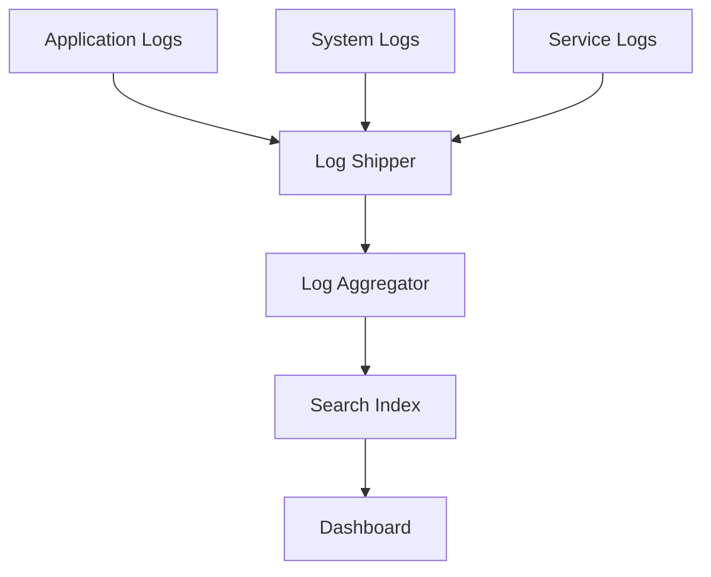

# System Monitoring in System Design 📌

## Table of Contents

- [Introduction](#introduction)
- [Prerequisites & Related Topics](#prerequisites--related-topics)
- [Pattern Recognition Guide](#pattern-recognition-guide)
- [Monitoring Fundamentals](#monitoring-fundamentals)
- [Logging Best Practices](#logging-best-practices)
- [Metrics Collection](#metrics-collection)
- [Alerting Strategies](#alerting-strategies)
- [Implementation Examples](#implementation-examples)
- [Trade-offs](#trade-offs)
- [Edge Cases to Consider](#edge-cases-to-consider)
- [Common Pitfalls](#common-pitfalls)
- [FAQ](#faq)
- [Interview Tips](#interview-tips)
- [Advanced Topics](#advanced-topics)
- [Further Reading](#further-reading)

## Introduction

Monitoring and logging are essential for understanding system behavior, troubleshooting issues, and maintaining system health.

### Key Components
1. **Metrics Collection**
2. **Log Aggregation**
3. **Alert Management**
4. **Visualization**
5. **Analysis Tools**

## Prerequisites & Related Topics

- Builds on: logging basics, time-series data
- Used in: [Metrics](../observability/metrics.md), [Alerting](../observability/alerting.md), [Distributed Tracing](../observability/distributed-tracing.md)
- Techniques often combined: SLOs and error budgets, RED/USE method, per-service dashboards
- See also: [Debug Strategies](../observability/debug-strategies.md) — the reason the signals exist

## Pattern Recognition Guide

### 🎯 When to Use System Monitoring

**Keywords in requirements**: "monitor", "alert", "dashboard", "SLI/SLO", "latency regression", "production visibility"
**Reach for this when**:
- Know before users do: latency, errors, saturation per service
- Capacity planning from growth trends
- Incident response with correlated metrics, logs, traces
- Verifying that a scaling or deploy change helped

### 🔑 Approach Indicators

| Approach | Signals | Best For |
|----------|---------|----------|
| Metrics | aggregates over time, cheap to keep | dashboards, alerts |
| Logs | per-event detail | debugging, audit |
| Traces | request journey across services | latency attribution |
| SLO burn alerts | user-impact pacing | paging decisions |

### ❌ When NOT to Use

- Alerting on everything — alert fatigue is the real outage
- Monitoring without SLOs — thresholds without user-impact context misfire
- Tracing every span at 100% — sample; keep errors at 100%

## Monitoring Fundamentals

### 1. System Metrics
**How it works — System monitor:** Collect the signal on a schedule, evaluate it against the defined threshold or SLO, and route any breach to the right channel with enough context to act without digging.

### 2. Application Metrics
**How it works — App metrics:** Collect the signal on a schedule, evaluate it against the defined threshold or SLO, and route any breach to the right channel with enough context to act without digging.

### 3. Health Checks
**How it works — Health check:** a liveness endpoint answers "is the process alive" (cheap, always local) and a readiness endpoint answers "can I serve" (checks DB/dependencies); balancers and orchestrators route on readiness and restart on liveness.

## Logging Best Practices

### 1. Structured Logging
**How it works — Structured logger:** Write the structured record at the moment the action happens — who, what, outcome — and ship it to the central store where retention and query tooling can make it useful later.

### 2. Log Levels
**How it works — Application logger:** Write the structured record at the moment the action happens — who, what, outcome — and ship it to the central store where retention and query tooling can make it useful later.

### 3. Log Aggregation

## Metrics Collection

### 1. Prometheus Integration
**How it works — Prometheus metrics:** Collect the signal on a schedule, evaluate it against the defined threshold or SLO, and route any breach to the right channel with enough context to act without digging.

### 2. Custom Metrics
**How it works — Business metrics:** Collect the signal on a schedule, evaluate it against the defined threshold or SLO, and route any breach to the right channel with enough context to act without digging.

## Alerting Strategies

### 1. Alert Rules
**Alert rules:** `HighCPUUsage`, `HighErrorRate` — each fires when its expression breaches the threshold for the configured duration.

### 2. Alert Management
**How it works — Alert manager:** Collect the signal on a schedule, evaluate it against the defined threshold or SLO, and route any breach to the right channel with enough context to act without digging.

## Implementation Examples

### 1. Monitoring Dashboard
**How it works — Dashboard metrics:** Collect the signal on a schedule, evaluate it against the defined threshold or SLO, and route any breach to the right channel with enough context to act without digging.

### 2. Log Analysis
**How it works — Log analyzer:** Write the structured record at the moment the action happens — who, what, outcome — and ship it to the central store where retention and query tooling can make it useful later.

## Trade-offs

| Choice | Pros | Cons | Best For |
|--------|------|------|----------|
| High-granularity metrics | Rich debugging detail | Storage cost, query load, cardinality explosion | Critical paths, incident investigation |
| Sampled logging | Cheap at high volume | May miss rare events | High-throughput services |
| More alert rules | Catches niche failures | Alert fatigue, on-call burnout | Post-incident targeted additions |
| SLO-based alerting | Aligns alerts with user impact | Requires error budgets and buy-in | Production services at scale |

**Visibility vs overhead:** Instrumentation consumes CPU, memory, and network — measure the cost of monitoring, especially at high request volume.

**Signal volume vs actionability:** More data is not more insight; over-alerting trains teams to ignore alerts.

**Centralization vs autonomy:** Central metrics/logging gives one place to look but creates a scaling bottleneck of its own.

> **⚠️ When NOT to monitor everything:** unbounded labels and per-request metrics explode cardinality and cost — instrument user-visible symptoms and business-critical paths first; you cannot alert your way out of a bad metric design.

## Edge Cases to Consider

- Low-traffic services — burn-rate alerts fire too slowly; use absolute floors
- Cardinality explosion from unbounded labels (user IDs in tags)
- Multi-window alerts both firing or neither — tune windows
- Histogram buckets missing the p99 tail
- Log volume cost dwarfs metric cost — tier retention

## Common Pitfalls

1. Averages hiding tail latency — percentiles or nothing
2. Alerts without runbooks
3. Dashboards nobody opens during incidents
4. No correlation IDs — signals cannot be joined
5. Monitoring the infrastructure, never the user journey

## FAQ

**Q1: Metrics, logs, or traces first?**

A: Metrics plus alerts on user-impact SLOs first — cheapest and answers "is it broken". Logs next for "why". Traces when latency questions span services.

**Q2: How do I stop alert fatigue?**

A: Page only on SLO burn (user impact), ticket the rest, require runbooks, and delete alerts that fired without action in the last quarter.

**Q3: What is the RED method?**

A: Rate, Errors, Duration per service — the minimal dashboard that catches most regressions before users report them.

## Interview Tips

### 1. Key Considerations
- Scalability of monitoring
- Data retention policies
- Alert fatigue prevention
- Performance impact
- Cost considerations

### 2. Common Questions
1. How would you design a monitoring system?
2. What metrics would you collect for a web application?
3. How do you handle log storage and retention?
4. Design an alerting system

### 3. Best Practices
- Use structured logging
- Implement proper error handling
- Set up meaningful alerts
- Monitor business metrics
- Regular system audits

## Advanced Topics

1. Multi-window multi-burn-rate alerting (Google SRE style)
2. Exemplars linking metrics to traces
3. OpenTelemetry for vendor-neutral collection
4. Anomaly detection for seasonal metrics

## Further Reading
- [Prometheus Documentation](https://prometheus.io/docs/introduction/overview/)
- [ELK Stack Guide](https://www.elastic.co/guide/index.html)
- [Google SRE Book](https://sre.google/sre-book/monitoring-distributed-systems/)
- [Grafana Documentation](https://grafana.com/docs/) 