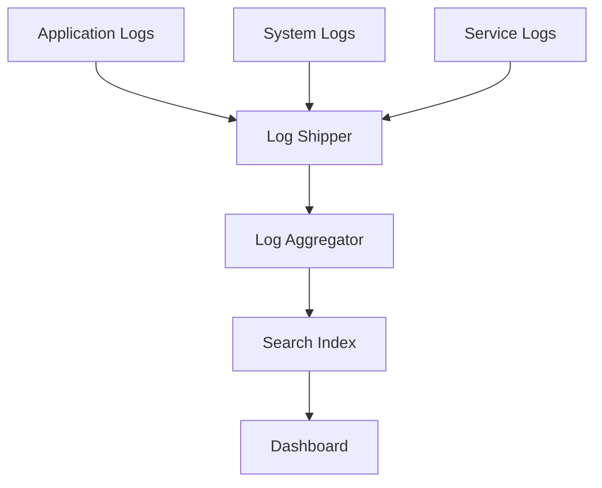

# Monitoring & Logging

## Table of Contents
- [Introduction](#introduction)
- [Monitoring Fundamentals](#monitoring-fundamentals)
- [Logging Best Practices](#logging-best-practices)
- [Metrics Collection](#metrics-collection)
- [Alerting Strategies](#alerting-strategies)
- [Implementation Examples](#implementation-examples)
- [Trade-offs](#trade-offs)
- [Interview Tips](#interview-tips)

## Introduction

Monitoring and logging are essential for understanding system behavior, troubleshooting issues, and maintaining system health.

### Key Components
1. **Metrics Collection**
2. **Log Aggregation**
3. **Alert Management**
4. **Visualization**
5. **Analysis Tools**

## Monitoring Fundamentals

### 1. System Metrics
```python
class SystemMonitor:
    def collect_metrics(self):
        """Collect system metrics."""
        return {
            'cpu_usage': psutil.cpu_percent(),
            'memory_usage': psutil.virtual_memory().percent,
            'disk_usage': psutil.disk_usage('/').percent,
            'network_io': psutil.net_io_counters()
        }
    
    def monitor_resources(self, interval=60):
        """Monitor system resources."""
        while True:
            metrics = self.collect_metrics()
            self.store_metrics(metrics)
            time.sleep(interval)
```

### 2. Application Metrics
```python
class AppMetrics:
    def __init__(self):
        self.metrics = {
            'requests_total': Counter('requests_total', 'Total requests'),
            'request_duration_seconds': Histogram(
                'request_duration_seconds', 
                'Request duration'
            ),
            'active_users': Gauge('active_users', 'Active users')
        }
    
    def track_request(self, duration):
        """Track request metrics."""
        self.metrics['requests_total'].inc()
        self.metrics['request_duration_seconds'].observe(duration)
```

### 3. Health Checks
```python
class HealthCheck:
    def check_database(self):
        """Check database connection."""
        try:
            db.execute('SELECT 1')
            return True
        except Exception as e:
            logger.error(f"Database health check failed: {e}")
            return False
    
    def check_services(self):
        """Check dependent services."""
        results = {}
        for service in self.services:
            try:
                response = requests.get(service.health_url)
                results[service.name] = response.status_code == 200
            except Exception as e:
                results[service.name] = False
        return results
```

## Logging Best Practices

### 1. Structured Logging
```python
class StructuredLogger:
    def __init__(self):
        self.logger = logging.getLogger(__name__)
    
    def log_event(self, event_type, **kwargs):
        """Log structured event."""
        log_entry = {
            'timestamp': datetime.utcnow().isoformat(),
            'event_type': event_type,
            'service': self.service_name,
            'data': kwargs
        }
        self.logger.info(json.dumps(log_entry))
```

### 2. Log Levels
```python
class ApplicationLogger:
    def __init__(self):
        self.logger = logging.getLogger(__name__)
        self.setup_logging()
    
    def setup_logging(self):
        """Configure logging."""
        logging.basicConfig(
            level=logging.INFO,
            format='%(asctime)s [%(levelname)s] %(message)s',
            handlers=[
                logging.FileHandler('app.log'),
                logging.StreamHandler()
            ]
        )
```

### 3. Log Aggregation


## Metrics Collection

### 1. Prometheus Integration
```python
class PrometheusMetrics:
    def __init__(self):
        self.registry = CollectorRegistry()
        self.metrics = {
            'http_requests_total': Counter(
                'http_requests_total',
                'Total HTTP requests',
                ['method', 'endpoint'],
                registry=self.registry
            ),
            'response_time_seconds': Histogram(
                'response_time_seconds',
                'Response time in seconds',
                registry=self.registry
            )
        }
    
    def track_request(self, method, endpoint, duration):
        """Track HTTP request metrics."""
        self.metrics['http_requests_total'].labels(
            method=method, 
            endpoint=endpoint
        ).inc()
        self.metrics['response_time_seconds'].observe(duration)
```

### 2. Custom Metrics
```python
class BusinessMetrics:
    def __init__(self):
        self.metrics = {
            'sales_total': Counter('sales_total', 'Total sales amount'),
            'active_users': Gauge('active_users', 'Number of active users'),
            'order_processing_time': Histogram(
                'order_processing_time',
                'Order processing duration'
            )
        }
    
    def track_sale(self, amount):
        """Track sale metrics."""
        self.metrics['sales_total'].inc(amount)
```

## Alerting Strategies

### 1. Alert Rules
```yaml
# Prometheus Alert Rules
groups:
- name: example
  rules:
  - alert: HighCPUUsage
    expr: cpu_usage_percent > 90
    for: 5m
    labels:
      severity: critical
    annotations:
      summary: High CPU usage detected
      description: CPU usage is above 90% for 5 minutes

  - alert: HighErrorRate
    expr: rate(http_requests_total{status=~"5.."}[5m]) > 1
    for: 2m
    labels:
      severity: warning
    annotations:
      summary: High error rate detected
      description: Error rate is above threshold
```

### 2. Alert Management
```python
class AlertManager:
    def __init__(self):
        self.handlers = {
            'critical': self.handle_critical,
            'warning': self.handle_warning,
            'info': self.handle_info
        }
    
    def process_alert(self, alert):
        """Process incoming alert."""
        severity = alert.get('severity', 'info')
        handler = self.handlers.get(severity, self.handle_info)
        handler(alert)
    
    def handle_critical(self, alert):
        """Handle critical alert."""
        self.notify_oncall()
        self.create_incident()
        self.send_notifications()
```

## Implementation Examples

### 1. Monitoring Dashboard
```python
class DashboardMetrics:
    def get_system_health(self):
        """Get system health metrics."""
        return {
            'system': self.get_system_metrics(),
            'application': self.get_app_metrics(),
            'database': self.get_db_metrics(),
            'services': self.get_service_health()
        }
    
    def get_system_metrics(self):
        """Get system metrics."""
        return {
            'cpu': self.cpu_metrics(),
            'memory': self.memory_metrics(),
            'disk': self.disk_metrics(),
            'network': self.network_metrics()
        }
```

### 2. Log Analysis
```python
class LogAnalyzer:
    def analyze_errors(self, timeframe):
        """Analyze error logs."""
        query = {
            'query': {
                'bool': {
                    'must': [
                        {'match': {'level': 'ERROR'}},
                        {'range': {
                            'timestamp': {
                                'gte': f'now-{timeframe}'
                            }
                        }}
                    ]
                }
            },
            'aggs': {
                'error_types': {
                    'terms': {'field': 'error_type'}
                }
            }
        }
        return elasticsearch.search(query)
```

## Trade-offs

| Choice | Pros | Cons | Best For |
|--------|------|------|----------|
| High-granularity metrics | Rich debugging detail | Storage cost, query load, cardinality explosion | Critical paths, incident investigation |
| Sampled logging | Cheap at high volume | May miss rare events | High-throughput services |
| More alert rules | Catches niche failures | Alert fatigue, on-call burnout | Post-incident targeted additions |
| SLO-based alerting | Aligns alerts with user impact | Requires error budgets and buy-in | Production services at scale |

**Visibility vs overhead:** Instrumentation consumes CPU, memory, and network — measure the cost of monitoring, especially at high request volume.

**Signal volume vs actionability:** More data is not more insight; over-alerting trains teams to ignore alerts.

**Centralization vs autonomy:** Central metrics/logging gives one place to look but creates a scaling bottleneck of its own.

## Interview Tips

### 1. Key Considerations
- Scalability of monitoring
- Data retention policies
- Alert fatigue prevention
- Performance impact
- Cost considerations

### 2. Common Questions
1. How would you design a monitoring system?
2. What metrics would you collect for a web application?
3. How do you handle log storage and retention?
4. Design an alerting system

### 3. Best Practices
- Use structured logging
- Implement proper error handling
- Set up meaningful alerts
- Monitor business metrics
- Regular system audits

## Further Reading
- [Prometheus Documentation](https://prometheus.io/docs/introduction/overview/)
- [ELK Stack Guide](https://www.elastic.co/guide/index.html)
- [Google SRE Book](https://sre.google/sre-book/monitoring-distributed-systems/)
- [Grafana Documentation](https://grafana.com/docs/) 